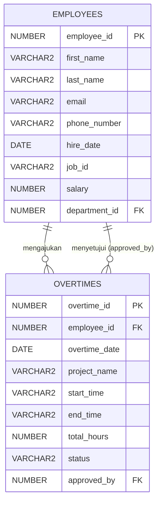

# Analisis Mockup & Desain Database: Overtime (Lembur)

Dokumen ini berisi analisis detail terhadap mockup halaman Overtime (Lembur), rancangan tabel database Oracle beserta relasinya, dan rancangan REST API yang akan diimplementasikan.

---

## 1. Analisis Elemen UI/Mockup
Berdasarkan mockup halaman `https://codeid.id/payroll/overtime/user`, berikut adalah komponen-komponen UI yang teridentifikasi:

### A. Informasi Pengguna (Logged-in User)
* **Nama Pengguna**: Rima
* **Role Pengguna**: `[ Programmer|Sales ]`
* *Implikasi*: Sistem membutuhkan informasi employee yang sedang login untuk memfilter data lembur milik mereka sendiri dan menentukan role untuk otorisasi (apakah dia berhak menyetujui lembur orang lain atau tidak).

### B. Filter & Pencarian
* **Periode Bulan**: Dropdown (Contoh: `February`, `March`)
* **Periode Tahun**: Dropdown (Contoh: `2024`, `2025`)
* **Tombol Search**: Memicu pencarian berdasarkan filter periode di atas.

### C. Aksi Utama
* **Tombol Add Overtime (+)**: Digunakan untuk membuka form pengajuan lembur baru.

### D. Tabel Data Overtime
Menampilkan daftar riwayat lembur dengan kolom-kolom sebagai berikut:
1. **Dates**: Tanggal lembur (Format: `DD/MM/YYYY`).
2. **Project**: Nama proyek atau aktivitas yang dikerjakan saat lembur (Contoh: `WebDev I`).
3. **Start Time**: Jam mulai lembur (Format: `HH:MI`, Contoh: `07:00`).
4. **End Time**: Jam selesai lembur (Format: `HH:MI`, Contoh: `09:00`).
5. **Total Hours**: Total jam lembur (Format desimal, Contoh: `1.00`).
6. **Status**: Status pengajuan lembur. Berdasarkan data, status yang mungkin:
   * `Request` (Baru diajukan, belum diproses)
   * `Approved` (Disetujui oleh atasan/manager)
   * `Completed` (Selesai diproses / dibayarkan)
   * `Rejected` (Ditolak - *tambahan standar flow*)
7. **Approved By**: Nama atasan yang menyetujui lembur (Contoh: `Widi`, `Annisa`).
8. **Actions**:
   * **Edit (Icon Pensil)**: Mengedit data lembur (hanya aktif jika status masih `Request`).
   * **Delete (Icon Silang)**: Menghapus pengajuan lembur (hanya aktif jika status masih `Request`).

---

## 2. Desain Database (Skema Oracle)

Untuk mendukung fitur lembur tersebut, kita akan membuat tabel bernama `overtimes`. Tabel ini berelasi langsung dengan tabel `employees` yang sudah ada di skema database HR Anda.

### A. Struktur Kolom Tabel `overtimes`

| Nama Kolom | Tipe Data | Constraint | Keterangan |
| :--- | :--- | :--- | :--- |
| `overtime_id` | `NUMBER` | `PRIMARY KEY` | ID unik untuk setiap lembur (menggunakan Sequence) |
| `employee_id` | `NUMBER` | `FOREIGN KEY` (ke `employees.employee_id`) | ID karyawan yang mengajukan lembur |
| `overtime_date` | `DATE` | `NOT NULL` | Tanggal dilakukannya lembur |
| `project_name` | `VARCHAR2(100)` | `NOT NULL` | Nama proyek/tugas lembur (e.g., 'WebDev I') |
| `start_time` | `VARCHAR2(5)` | `NOT NULL` | Format 'HH24:MI' (e.g., '07:00') |
| `end_time` | `VARCHAR2(5)` | `NOT NULL` | Format 'HH24:MI' (e.g., '09:00') |
| `total_hours` | `NUMBER(4,2)` | `NOT NULL` | Jumlah jam lembur (e.g., 2.00) |
| `status` | `VARCHAR2(20)` | `DEFAULT 'Request'` | Status lembur: `Request`, `Approved`, `Completed`, `Rejected` |
| `approved_by` | `NUMBER` | `FOREIGN KEY` (ke `employees.employee_id`) | ID karyawan/atasan yang menyetujui lembur |

### B. Relasi Tabel (Entity Relationship)
* **`employees` 1 ─── 0..* `overtimes` (Pengaju)**
  * Satu karyawan (`employees`) dapat mengajukan banyak data lembur (`overtimes`).
  * Relasi ini dihubungkan oleh kolom `overtimes.employee_id` -> `employees.employee_id`.
* **`employees` 1 ─── 0..* `overtimes` (Penyetuju)**
  * Satu karyawan (dengan role Manager/Atasan) dapat menyetujui banyak data lembur (`overtimes`).
  * Relasi ini dihubungkan oleh kolom `overtimes.approved_by` -> `employees.employee_id`.



---

## 3. Skrip DDL Oracle (Pembuatan Tabel & Sequence)

Berikut skrip SQL yang dapat dijalankan untuk membuat tabel `overtimes` dan sequence-nya:

```sql
-- 1. Membuat Sequence untuk Overtime ID
CREATE SEQUENCE overtimes_seq
    START WITH 1
    INCREMENT BY 1
    NOCACHE
    NOCYCLE;

-- 2. Membuat Tabel Overtimes
CREATE TABLE overtimes (
    overtime_id NUMBER,
    employee_id NUMBER NOT NULL,
    overtime_date DATE NOT NULL,
    project_name VARCHAR2(100) NOT NULL,
    start_time VARCHAR2(5) NOT NULL,
    end_time VARCHAR2(5) NOT NULL,
    total_hours NUMBER(4,2) NOT NULL,
    status VARCHAR2(20) DEFAULT 'Request',
    approved_by NUMBER,
    -- Constraints
    CONSTRAINT pk_overtime_id PRIMARY KEY (overtime_id),
    CONSTRAINT fk_overtime_employee_id FOREIGN KEY (employee_id) 
        REFERENCES employees(employee_id) ON DELETE CASCADE,
    CONSTRAINT fk_overtime_approved_by FOREIGN KEY (approved_by) 
        REFERENCES employees(employee_id) ON DELETE SET NULL,
    CONSTRAINT chk_overtime_status CHECK (status IN ('Request', 'Approved', 'Completed', 'Rejected')),
    CONSTRAINT chk_overtime_time_format CHECK (
        REGEXP_LIKE(start_time, '^[0-9]{2}:[0-9]{2}$') AND 
        REGEXP_LIKE(end_time, '^[0-9]{2}:[0-9]{2}$')
    )
);
```

---

## 4. Rancangan REST API (Routes & Payloads)

Untuk memfasilitasi kebutuhan CRUD halaman Overtime, berikut rancangan endpoint Express.js:

### A. Mendapatkan Daftar Lembur (Filter Periode & Employee)
* **Endpoint**: `GET /api/overtimes`
* **Query Params**:
  * `employeeId` (Optional: Filter lembur karyawan tertentu)
  * `month` (Optional: e.g. `2` atau `February`)
  * `year` (Optional: e.g. `2025`)
* **Response (Success - 200 OK)**:
  ```json
  [
    {
      "overtimeId": 1,
      "employeeId": 101,
      "employeeName": "Rima",
      "overtimeDate": "2025-03-12",
      "projectName": "WebDev I",
      "startTime": "07:00",
      "endTime": "09:00",
      "totalHours": 1.00,
      "status": "Request",
      "approvedBy": null,
      "approverName": null
    },
    {
      "overtimeId": 2,
      "employeeId": 101,
      "employeeName": "Rima",
      "overtimeDate": "2025-03-15",
      "projectName": "WebDev I",
      "startTime": "07:00",
      "endTime": "09:00",
      "totalHours": 1.00,
      "status": "Approved",
      "approvedBy": 102,
      "approverName": "Widi"
    }
  ]
  ```

### B. Mengajukan Lembur Baru (Create)
* **Endpoint**: `POST /api/overtimes`
* **Request Body**:
  ```json
  {
    "employeeId": 101,
    "overtimeDate": "2025-03-12",
    "projectName": "WebDev I",
    "startTime": "07:00",
    "endTime": "09:00",
    "totalHours": 1.00
  }
  ```
* **Response (Success - 210 Created / 201 Created)**:
  ```json
  {
    "message": "Overtime request submitted successfully",
    "data": {
      "overtimeId": 1,
      "employeeId": 101,
      "projectName": "WebDev I",
      "status": "Request"
    }
  }
  ```

### C. Mengubah Data Lembur (Update)
* **Endpoint**: `PUT /api/overtimes/:id`
* **Request Body**:
  ```json
  {
    "projectName": "WebDev I Updated",
    "startTime": "07:00",
    "endTime": "10:00",
    "totalHours": 3.00
  }
  ```
* **Notes**: Hanya bisa dilakukan jika `status` lama adalah `Request`.

### D. Mengubah Status / Approval Lembur
* **Endpoint**: `PATCH /api/overtimes/:id/approve`
* **Request Body**:
  ```json
  {
    "approvedBy": 102,
    "status": "Approved" // atau 'Rejected'
  }
  ```

### E. Menghapus Lembur (Delete)
* **Endpoint**: `DELETE /api/overtimes/:id`
* **Notes**: Hanya bisa dihapus jika `status` adalah `Request`.
