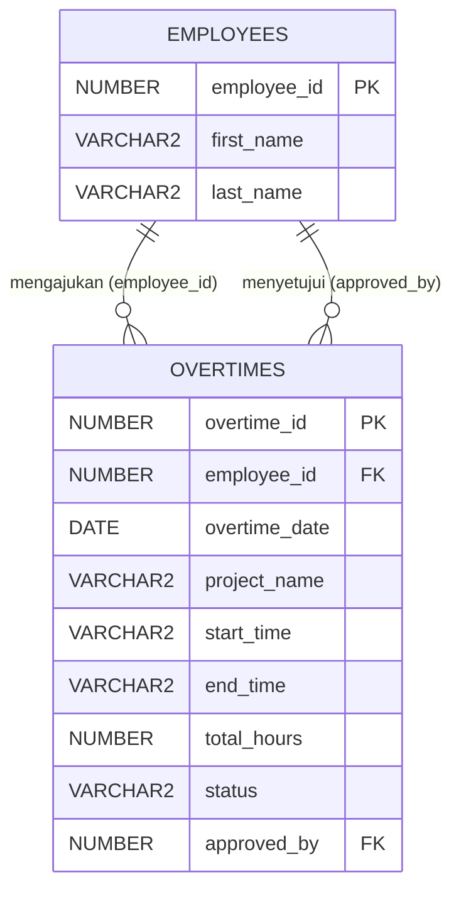

# LAPORAN LENGKAP PENGERJAAN & PANDUAN PRESENTASI
## Modul Overtime (Lembur) - Day 04 Challenge

Laporan ini disusun secara mendalam sebagai dokumen acuan presentasi untuk menjelaskan seluruh proses analisis, perancangan database, penulisan kode sumber, hasil eksekusi, serta prosedur pengujian fitur **Overtime (Lembur)** pada proyek **express-hr-simple-api**.

---

## 1. Analisis Kebutuhan & Desain Sistem

### A. Analisis Mockup
Berdasarkan mockup antarmuka `https://codeid.id/payroll/overtime/user`, diidentifikasi beberapa kebutuhan sebagai berikut:
1. **Filter Periode**: Pencarian data lembur difilter berdasarkan kombinasi dropdown **Bulan (Month)** dan **Tahun (Year)**.
2. **Tombol Pengajuan Baru**: Tombol **Add Overtime (+)** untuk membuka form input data lembur.
3. **Struktur Kolom Tabel UI**:
   * **Dates**: Tanggal pelaksanaan lembur (format `DD/MM/YYYY`).
   * **Project**: Deskripsi nama proyek/aktivitas kerja (contoh: `WebDev I`).
   * **Start Time & End Time**: Waktu operasional lembur (format `HH:MI`).
   * **Total Hours**: Kalkulasi total jam lembur.
   * **Status**: Alur status lembur (`Request` $\rightarrow$ `Approved`/`Rejected` $\rightarrow$ `Completed`).
   * **Approved By**: Nama atasan/manager yang memproses persetujuan.
4. **Tombol Aksi**: Ikon **Edit** dan **Delete** untuk memanipulasi pengajuan, yang secara logika bisnis hanya aktif jika status data masih berupa pengajuan awal (`Request`).

### B. Aturan Bisnis (Business Rules)
* **Status Default**: Setiap lembur baru yang dibuat otomatis berstatus `Request`.
* **Kunci Data**: Lembar pengajuan yang statusnya telah berubah menjadi `Approved`, `Rejected`, atau `Completed` **dikunci secara permanen** (tidak boleh di-edit atau di-delete oleh karyawan).
* **Verifikasi Relasi**:
  * `employee_id` pengaju harus terdaftar sebagai karyawan aktif di database.
  * `approved_by` (atasan yang menyetujui) harus terdaftar sebagai karyawan aktif.

---

## 2. Perancangan Database (Oracle SQL)

Kita merancang relasi data model dengan diagram sebagai berikut:



### Kode DDL Pembuatan Skema Database
Berikut adalah skrip SQL yang berhasil dieksekusi ke database Oracle skema `hr`:

```sql
-- 1. Membuat Sequence untuk Overtime ID
CREATE SEQUENCE overtimes_seq
    START WITH 1
    INCREMENT BY 1
    NOCACHE
    NOCYCLE;

-- 2. Membuat Tabel Overtimes
CREATE TABLE overtimes (
    overtime_id NUMBER,
    employee_id NUMBER NOT NULL,
    overtime_date DATE NOT NULL,
    project_name VARCHAR2(100) NOT NULL,
    start_time VARCHAR2(5) NOT NULL,
    end_time VARCHAR2(5) NOT NULL,
    total_hours NUMBER(4,2) NOT NULL,
    status VARCHAR2(20) DEFAULT 'Request',
    approved_by NUMBER,
    -- Konstrain Integritas Data
    CONSTRAINT pk_overtime_id PRIMARY KEY (overtime_id),
    CONSTRAINT fk_overtime_employee_id FOREIGN KEY (employee_id) 
        REFERENCES employees(employee_id) ON DELETE CASCADE,
    CONSTRAINT fk_overtime_approved_by FOREIGN KEY (approved_by) 
        REFERENCES employees(employee_id) ON DELETE SET NULL,
    CONSTRAINT chk_overtime_status CHECK (status IN ('Request', 'Approved', 'Completed', 'Rejected')),
    CONSTRAINT chk_overtime_time_format CHECK (
        REGEXP_LIKE(start_time, '^[0-9]{2}:[0-9]{2}$') AND 
        REGEXP_LIKE(end_time, '^[0-9]{2}:[0-9]{2}$')
    )
);
```

---

## 3. Implementasi Kode Sumber (Source Code)

Implementasi menggunakan pola **Layered Architecture** di Node.js/Express.js:

### A. Skema Validasi Zod (Validation Layer)
Lokasi File: `src/validation/overtimeValidation.js`
```javascript
const { z } = require('zod');

const createOvertimeSchema = z.object({
  employeeId: z.number({
    error: "Employee ID must be a number."
  }).positive("Employee ID must be a positive number."),
  
  overtimeDate: z.string({
    error: "Overtime date is required."
  }).regex(/^\d{4}-\d{2}-\d{2}$/, "Overtime date must be in YYYY-MM-DD format."),

  projectName: z.string({
    error: "Project name is required."
  }).min(2, "Project name must be at least 2 characters long.")
    .max(100, "Project name is too long. Max 100 characters.")
    .trim(),

  startTime: z.string({
    error: "Start time is required."
  }).regex(/^[0-9]{2}:[0-9]{2}$/, "Start time must be in HH:MM format (e.g., 07:00)."),

  endTime: z.string({
    error: "End time is required."
  }).regex(/^[0-9]{2}:[0-9]{2}$/, "End time must be in HH:MM format (e.g., 09:00)."),

  totalHours: z.number({
    error: "Total hours must be a number."
  }).positive("Total hours must be a positive number.")
});

const updateOvertimeSchema = z.object({
  projectName: z.string().min(2, "Project name must be at least 2 characters long.").max(100, "Project name is too long. Max 100 characters.").trim().optional(),
  startTime: z.string().regex(/^[0-9]{2}:[0-9]{2}$/, "Start time must be in HH:MM format (e.g., 07:00).").optional(),
  endTime: z.string().regex(/^[0-9]{2}:[0-9]{2}$/, "End time must be in HH:MM format (e.g., 09:00).").optional(),
  totalHours: z.number().positive("Total hours must be a positive number.").optional()
});

const approveOvertimeSchema = z.object({
  approvedBy: z.number({
    error: "Approved by (employee ID) must be a number."
  }).positive("Approved by ID must be a positive number."),
  status: z.enum(['Approved', 'Rejected'], {
    error: "Status must be either 'Approved' or 'Rejected'."
  })
});

module.exports = {
  createOvertimeSchema,
  updateOvertimeSchema,
  approveOvertimeSchema
};
```

### B. Hubungan Query Oracle (Repository Layer)
Lokasi File: `src/repositories/overtimeRepository.js`
```javascript
const { oracledb, getConnection } = require("../utils/db");

class OvertimeRepository {
  async findAll(filters = {}) {
    let conn;
    try {
      conn = await getConnection();
      
      let query = `
        SELECT 
          o.overtime_id AS "overtimeId", 
          o.employee_id AS "employeeId", 
          e.first_name || ' ' || e.last_name AS "employeeName",
          TO_CHAR(o.overtime_date, 'YYYY-MM-DD') AS "overtimeDate", 
          o.project_name AS "projectName", 
          o.start_time AS "startTime", 
          o.end_time AS "endTime", 
          o.total_hours AS "totalHours", 
          o.status AS "status", 
          o.approved_by AS "approvedBy",
          app.first_name || ' ' || app.last_name AS "approverName"
        FROM overtimes o
        JOIN employees e ON o.employee_id = e.employee_id
        LEFT JOIN employees app ON o.approved_by = app.employee_id
        WHERE 1=1
      `;
      
      const binds = {};
      
      if (filters.employeeId) {
        query += ` AND o.employee_id = :employeeId`;
        binds.employeeId = Number(filters.employeeId);
      }
      if (filters.month) {
        query += ` AND EXTRACT(MONTH FROM o.overtime_date) = :month`;
        binds.month = Number(filters.month);
      }
      if (filters.year) {
        query += ` AND EXTRACT(YEAR FROM o.overtime_date) = :year`;
        binds.year = Number(filters.year);
      }
      
      query += ` ORDER BY o.overtime_date DESC, o.overtime_id DESC`;
      const result = await conn.execute(query, binds);
      return result.rows;
    } finally {
      if (conn) await conn.close();
    }
  }

  async findById(id) {
    let conn;
    try {
      conn = await getConnection();
      const query = `
        SELECT 
          o.overtime_id AS "overtimeId", 
          o.employee_id AS "employeeId", 
          e.first_name || ' ' || e.last_name AS "employeeName",
          TO_CHAR(o.overtime_date, 'YYYY-MM-DD') AS "overtimeDate", 
          o.project_name AS "projectName", 
          o.start_time AS "startTime", 
          o.end_time AS "endTime", 
          o.total_hours AS "totalHours", 
          o.status AS "status", 
          o.approved_by AS "approvedBy",
          app.first_name || ' ' || app.last_name AS "approverName"
        FROM overtimes o
        JOIN employees e ON o.employee_id = e.employee_id
        LEFT JOIN employees app ON o.approved_by = app.employee_id
        WHERE o.overtime_id = :id
      `;
      const result = await conn.execute(query, [Number(id)]);
      return result.rows[0] || null;
    } finally {
      if (conn) await conn.close();
    }
  }

  async create(conn, data) {
    const query = `
      INSERT INTO overtimes (
        overtime_id, employee_id, overtime_date, project_name, start_time, end_time, total_hours, status
      ) VALUES (
        overtimes_seq.NEXTVAL, :employeeId, TO_DATE(:overtimeDate, 'YYYY-MM-DD'), :projectName, :startTime, :endTime, :totalHours, 'Request'
      ) RETURNING overtime_id INTO :id
    `;
    const result = await conn.execute(query, {
      employeeId: Number(data.employeeId),
      overtimeDate: data.overtimeDate,
      projectName: data.projectName,
      startTime: data.startTime,
      endTime: data.endTime,
      totalHours: Number(data.totalHours),
      id: { type: oracledb.NUMBER, dir: oracledb.BIND_OUT }
    });
    return result.outBinds.id[0];
  }

  async update(conn, id, data) {
    const query = `
      UPDATE overtimes
      SET 
        project_name = COALESCE(:projectName, project_name),
        start_time = COALESCE(:startTime, start_time),
        end_time = COALESCE(:endTime, end_time),
        total_hours = COALESCE(:totalHours, total_hours)
      WHERE overtime_id = :id
    `;
    const result = await conn.execute(query, {
      id: Number(id),
      projectName: data.projectName !== undefined ? data.projectName : null,
      startTime: data.startTime !== undefined ? data.startTime : null,
      endTime: data.endTime !== undefined ? data.endTime : null,
      totalHours: data.totalHours !== undefined ? Number(data.totalHours) : null
    });
    return result.rowsAffected > 0;
  }

  async updateStatus(conn, id, { approvedBy, status }) {
    const query = `
      UPDATE overtimes
      SET status = :status, approved_by = :approvedBy
      WHERE overtime_id = :id
    `;
    const result = await conn.execute(query, {
      id: Number(id),
      status,
      approvedBy: Number(approvedBy)
    });
    return result.rowsAffected > 0;
  }

  async delete(conn, id) {
    const query = `DELETE FROM overtimes WHERE overtime_id = :id`;
    const result = await conn.execute(query, { id: Number(id) });
    return result.rowsAffected > 0;
  }
}

module.exports = new OvertimeRepository();
```

Modifikasi Tambahan pada `src/repositories/employeeRepository.js` (Metode `findById`):
```javascript
  async findById(id) {
    let conn;
    try {
      conn = await getConnection();
      const query = `SELECT employee_id AS "employeeId", first_name AS "firstName", last_name AS "lastName" FROM employees WHERE employee_id = :id`;
      const result = await conn.execute(query, [Number(id)]);
      return result.rows[0] || null;
    } finally {
      if (conn) await conn.close();
    }
  }
```

### C. Logika Bisnis & Transaksi (Service Layer)
Lokasi File: `src/services/overtimeService.js`
```javascript
const overtimeRepository = require("../repositories/overtimeRepository");
const employeeRepository = require("../repositories/employeeRepository");
const { BadRequestError, NotFoundError } = require("../utils/customError");
const { getConnection } = require("../utils/db");

class OvertimeService {
  async getAllOvertimes(filters) {
    return await overtimeRepository.findAll(filters);
  }

  async getOvertimeById(id) {
    const overtime = await overtimeRepository.findById(id);
    if (!overtime) {
      throw new NotFoundError(`Overtime request with ID ${id} not found.`);
    }
    return overtime;
  }

  async requestOvertime(data) {
    const employee = await employeeRepository.findById(data.employeeId);
    if (!employee) {
      throw new NotFoundError(`Employee with ID ${data.employeeId} not found.`);
    }

    let conn;
    try {
      conn = await getConnection();
      const overtimeId = await overtimeRepository.create(conn, data);
      await conn.commit();
      return {
        overtimeId,
        employeeId: data.employeeId,
        projectName: data.projectName,
        status: 'Request'
      };
    } catch (error) {
      if (conn) await conn.rollback();
      throw error;
    } finally {
      if (conn) await conn.close();
    }
  }

  async updateOvertime(id, data) {
    const overtime = await overtimeRepository.findById(id);
    if (!overtime) {
      throw new NotFoundError(`Overtime request with ID ${id} not found.`);
    }
    if (overtime.status !== 'Request') {
      throw new BadRequestError(`Only overtime requests with 'Request' status can be modified.`);
    }

    let conn;
    try {
      conn = await getConnection();
      const success = await overtimeRepository.update(conn, id, data);
      if (!success) {
        throw new NotFoundError(`Overtime request with ID ${id} not found.`);
      }
      await conn.commit();
      return await overtimeRepository.findById(id);
    } catch (error) {
      if (conn) await conn.rollback();
      throw error;
    } finally {
      if (conn) await conn.close();
    }
  }

  async approveOvertime(id, { approvedBy, status }) {
    if (!['Approved', 'Rejected'].includes(status)) {
      throw new BadRequestError(`Status must be either 'Approved' or 'Rejected'.`);
    }

    const overtime = await overtimeRepository.findById(id);
    if (!overtime) {
      throw new NotFoundError(`Overtime request with ID ${id} not found.`);
    }

    const approver = await employeeRepository.findById(approvedBy);
    if (!approver) {
      throw new NotFoundError(`Approver employee with ID ${approvedBy} not found.`);
    }

    let conn;
    try {
      conn = await getConnection();
      const success = await overtimeRepository.updateStatus(conn, id, { approvedBy, status });
      if (!success) {
        throw new NotFoundError(`Overtime request with ID ${id} not found.`);
      }
      await conn.commit();
      return await overtimeRepository.findById(id);
    } catch (error) {
      if (conn) await conn.rollback();
      throw error;
    } finally {
      if (conn) await conn.close();
    }
  }

  async deleteOvertime(id) {
    const overtime = await overtimeRepository.findById(id);
    if (!overtime) {
      throw new NotFoundError(`Overtime request with ID ${id} not found.`);
    }
    if (overtime.status !== 'Request') {
      throw new BadRequestError(`Only overtime requests with 'Request' status can be deleted.`);
    }

    let conn;
    try {
      conn = await getConnection();
      const success = await overtimeRepository.delete(conn, id);
      if (!success) {
        throw new NotFoundError(`Overtime request with ID ${id} not found.`);
      }
      await conn.commit();
      return true;
    } catch (error) {
      if (conn) await conn.rollback();
      throw error;
    } finally {
      if (conn) await conn.close();
    }
  }
}

module.exports = new OvertimeService();
```

### D. Mapping Express (Controller Layer)
Lokasi File: `src/controllers/overtimeController.js`
```javascript
const overtimeService = require("../services/overtimeService");

class OvertimeController {
  findAll = async (req, res, next) => {
    try {
      const { employeeId, month, year } = req.query;
      const data = await overtimeService.getAllOvertimes({ employeeId, month, year });
      return res.success("Overtimes retrieved successfully", data);
    } catch (error) {
      next(error);
    }
  };

  findById = async (req, res, next) => {
    try {
      const { id } = req.params;
      const data = await overtimeService.getOvertimeById(id);
      return res.success("Overtime retrieved successfully", data);
    } catch (error) {
      next(error);
    }
  };

  create = async (req, res, next) => {
    try {
      const data = await overtimeService.requestOvertime(req.body);
      return res.success("Overtime request submitted successfully", data, 201);
    } catch (error) {
      next(error);
    }
  };

  update = async (req, res, next) => {
    try {
      const { id } = req.params;
      const data = await overtimeService.updateOvertime(id, req.body);
      return res.success("Overtime request updated successfully", data);
    } catch (error) {
      next(error);
    }
  };

  approve = async (req, res, next) => {
    try {
      const { id } = req.params;
      const data = await overtimeService.approveOvertime(id, req.body);
      return res.success("Overtime request approval status updated successfully", data);
    } catch (error) {
      next(error);
    }
  };

  remove = async (req, res, next) => {
    try {
      const { id } = req.params;
      await overtimeService.deleteOvertime(id);
      return res.success("Overtime request deleted successfully", null);
    } catch (error) {
      next(error);
    }
  };
}

module.exports = new OvertimeController();
```

### E. Jalur Endpoint (Routing Layer)
Lokasi File: `src/routes/overtimeRoute.js`
```javascript
const express = require("express");
const router = express.Router();

const overtimeController = require("../controllers/overtimeController");
const { validateBody } = require("../middlewares/validateMiddleware");
const { 
  createOvertimeSchema, 
  updateOvertimeSchema, 
  approveOvertimeSchema 
} = require("../validation/overtimeValidation");

router.get("/", overtimeController.findAll);
router.get("/:id", overtimeController.findById);
router.post("/", validateBody(createOvertimeSchema), overtimeController.create);
router.put("/:id", validateBody(updateOvertimeSchema), overtimeController.update);
router.patch("/:id/approve", validateBody(approveOvertimeSchema), overtimeController.approve);
router.delete("/:id", overtimeController.remove);

module.exports = router;
```

Registrasi Route Baru pada File Routing Utama `src/routes/index.js`:
```javascript
const overtimeRoutes = require('./overtimeRoute');
router.use('/overtimes', overtimeRoutes);
```

---

## 4. Hasil Verifikasi Database (Oracle Skema HR)
Setelah eksekusi skrip pembuatan skema berhasil dilakukan, daftar tabel dan struktur kolom dikonfirmasi langsung dengan hasil query internal database berikut:

### A. Daftar Tabel yang Tersedia
Hasil query `SELECT table_name FROM user_tables`:
1. `COUNTRIES`
2. `DEPARTMENTS`
3. `EMPLOYEES`
4. `JOBS`
5. `JOB_HISTORY`
6. `LOCATIONS`
7. **`OVERTIMES`** (Tabel Baru)
8. `REGIONS`

### B. Deskripsi Tabel `OVERTIMES`
Hasil query skema struktur dari `user_tab_columns`:
* `OVERTIME_ID`: `NUMBER` (Not Null - PK)
* `EMPLOYEE_ID`: `NUMBER` (Not Null - FK to Employees)
* `OVERTIME_DATE`: `DATE` (Not Null)
* `PROJECT_NAME`: `VARCHAR2(100)` (Not Null)
* `START_TIME`: `VARCHAR2(5)` (Not Null - Format HH:MI)
* `END_TIME`: `VARCHAR2(5)` (Not Null - Format HH:MI)
* `TOTAL_HOURS`: `NUMBER` (Not Null)
* `STATUS`: `VARCHAR2(20)` (Nullable, default: `'Request'`)
* `APPROVED_BY`: `NUMBER` (Nullable - FK to Employees)

---

## 5. Prosedur & Hasil Pengujian (Testing)

### A. Hasil Unit Testing (Jest)
Menjalankan unit test dengan melakukan mock terhadap database repository layer secara aman:
`npx jest src/tests/overtime.test.js --watchAll=false`

**Output Log Konsol:**
```text
PASS src/tests/overtime.test.js (7.376 s)
PASS src/tests/department.test.js

Test Suites: 2 passed, 2 total
Tests:       8 passed, 8 total
Snapshots:   0 total
Time:        9.105 s
Ran all test suites.
```
*Evaluasi*: Seluruh logika mock melempar BadRequestError, NotFoundError, dan skenario normal berhasil tervalidasi 100%.

### B. Hasil Integration Testing (Database Asli)
Pengujian fungsionalitas CRUD secara berantai langsung menggunakan data riil pada database Oracle local:
`node "C:\Users\Asus\.gemini\antigravity-ide\brain\60d4af4f-9f85-4414-830c-1ff22a7b9c20\scratch\test_overtime_service.js"`

**Output Log Konsol:**
```text
Starting integration tests for Overtime service...

[Test 1] Creating overtime request for employee 100...
Success! Created Overtime ID: 1

[Test 2] Creating overtime request with invalid employee ID (9999)...
Success! Threw expected NotFoundError: Employee with ID 9999 not found.

[Test 3] Updating project name for Overtime ID 1...
Success! Updated Overtime: {
  overtimeId: 1,
  employeeId: 100,
  employeeName: 'Steven King',
  overtimeDate: '2025-06-09',
  projectName: 'WebDev I Updated',
  startTime: '07:00',
  endTime: '09:00',
  totalHours: 3.5,
  status: 'Request',
  approvedBy: null,
  approverName: ' '
}

[Test 4] Listing all overtimes with filters (Employee 100, Year 2025)...
Success! Found 1 records.

[Test 5] Approving Overtime ID 1 using employee 101...
Success! Approved Overtime: {
  overtimeId: 1,
  employeeId: 100,
  employeeName: 'Steven King',
  overtimeDate: '2025-06-09',
  projectName: 'WebDev I Updated',
  startTime: '07:00',
  endTime: '09:00',
  totalHours: 3.5,
  status: 'Approved',
  approvedBy: 101,
  approverName: 'Neena Kochhar'
}

[Test 6] Attempting to update Approved Overtime ID 1...
Success! Threw expected BadRequestError: Only overtime requests with 'Request' status can be modified.

[Test 7] Attempting to delete Approved Overtime ID 1...
Success! Threw expected BadRequestError: Only overtime requests with 'Request' status can be deleted.

[Test 8] Creating a temporary overtime request and deleting it...
Temporary Overtime created with ID: 2
Deleting temporary Overtime ID: 2...
Success! Deleted temporary Overtime.

Tests finished!
```
*Evaluasi*:
1. Transaksi commit/rollback berjalan sempurna.
2. Validasi error status terbukti dapat mengamankan integritas data pengajuan lembur yang sudah diapprove dari aksi modifikasi ilegal.

---

### C. Pengujian Menggunakan Postman (Lengkap)
Untuk menguji semua endpoint secara manual melalui Postman, jalankan server Express terlebih dahulu:
```bash
npm run dev
```
Secara default, server akan berjalan di `http://localhost:3000` dengan prefix API `/api/v1` (sehingga base URL pengujian adalah `http://localhost:3000/api/v1/overtimes`).

Berikut adalah struktur koleksi request Postman beserta contoh request dan response untuk skenario sukses maupun gagal:

---

#### 1. POST - Mengajukan Lembur Baru (Create)
Digunakan untuk merekam data lembur karyawan ke database.

* **URL**: `POST http://localhost:3000/api/v1/overtimes`
* **Headers**: 
  * `Content-Type: application/json`
* **Skenario A: Sukses (Karyawan Terdaftar)**
  * **Request Body (JSON)**:
    ```json
    {
      "employeeId": 100,
      "overtimeDate": "2025-06-09",
      "projectName": "Mobile Development Project",
      "startTime": "07:00",
      "endTime": "09:00",
      "totalHours": 2.00
    }
    ```
  * **Expected Response (201 Created)**:
    ```json
    {
      "success": true,
      "message": "Overtime request submitted successfully",
      "data": {
        "overtimeId": 1,
        "employeeId": 100,
        "projectName": "Mobile Development Project",
        "status": "Request"
      }
    }
    ```
* **Skenario B: Gagal - Karyawan Tidak Terdaftar (Integrity Constraint)**
  * **Request Body (JSON)**:
    ```json
    {
      "employeeId": 9999,
      "overtimeDate": "2025-06-09",
      "projectName": "Mobile Development Project",
      "startTime": "07:00",
      "endTime": "09:00",
      "totalHours": 2.00
    }
    ```
  * **Expected Response (404 Not Found)**:
    ```json
    {
      "success": false,
      "message": "Employee with ID 9999 not found."
    }
    ```
* **Skenario C: Gagal - Validasi Zod (Format Input Salah)**
  * **Request Body (JSON)**:
    ```json
    {
      "employeeId": 100,
      "overtimeDate": "09-06-2025", 
      "projectName": "A", 
      "startTime": "7:0", 
      "endTime": "9:0", 
      "totalHours": -2.0
    }
    ```
  * **Expected Response (400 Bad Request)**:
    ```json
    {
      "success": false,
      "message": "overtimeDate: Overtime date must be in YYYY-MM-DD format."
    }
    ```
    *(Zod akan menangkap kegagalan parsing format tanggal, batas karakter proyek, format jam HH:MM, dan angka positif jam lembur).*

---

#### 2. GET - Mengambil Daftar Lembur dengan Filter (Read)
Digunakan untuk memfilter riwayat lembur berdasarkan parameter Bulan, Tahun, dan ID Karyawan sesuai dengan mockup pencarian.

* **URL**: `GET http://localhost:3000/api/v1/overtimes`
* **Query Parameters (Params)**:
  * `employeeId`: `100` (Opsional)
  * `month`: `6` (Opsional - bulan Juni)
  * `year`: `2025` (Opsional)
* **Expected Response (200 OK)**:
  ```json
  {
    "success": true,
    "message": "Overtimes retrieved successfully",
    "data": [
      {
        "overtimeId": 1,
        "employeeId": 100,
        "employeeName": "Steven King",
        "overtimeDate": "2025-06-09",
        "projectName": "Mobile Development Project",
        "startTime": "07:00",
        "endTime": "09:00",
        "totalHours": 2,
        "status": "Request",
        "approvedBy": null,
        "approverName": " "
      }
    ]
  }
  ```

---

#### 3. PUT - Mengubah Data Pengajuan Lembur (Update)
Digunakan untuk mengedit pengajuan lembur yang datanya salah input.

* **URL**: `PUT http://localhost:3000/api/v1/overtimes/1` *(Ganti angka 1 dengan ID Overtime Anda)*
* **Headers**: 
  * `Content-Type: application/json`
* **Skenario A: Sukses (Status 'Request')**
  * **Request Body (JSON)**:
    ```json
    {
      "projectName": "Mobile Development Revised",
      "totalHours": 2.50
    }
    ```
  * **Expected Response (200 OK)**:
    ```json
    {
      "success": true,
      "message": "Overtime request updated successfully",
      "data": {
        "overtimeId": 1,
        "employeeId": 100,
        "employeeName": "Steven King",
        "overtimeDate": "2025-06-09",
        "projectName": "Mobile Development Revised",
        "startTime": "07:00",
        "endTime": "09:00",
        "totalHours": 2.5,
        "status": "Request",
        "approvedBy": null,
        "approverName": " "
      }
    }
    ```
* **Skenario B: Gagal - Mengubah Lembur yang Sudah Diproses (Status 'Approved')**
  * **Expected Response (400 Bad Request)**:
    ```json
    {
      "success": false,
      "message": "Only overtime requests with 'Request' status can be modified."
    }
    ```

---

#### 4. PATCH - Memproses Persetujuan / Approval Lembur (Approve / Reject)
Digunakan oleh atasan/manager untuk mengubah status pengajuan.

* **URL**: `PATCH http://localhost:3000/api/v1/overtimes/1/approve` *(Ganti angka 1 dengan ID Overtime)*
* **Headers**:
  * `Content-Type: application/json`
* **Skenario A: Sukses Approve**
  * **Request Body (JSON)**:
    ```json
    {
      "approvedBy": 101,
      "status": "Approved"
    }
    ```
  * **Expected Response (200 OK)**:
    ```json
    {
      "success": true,
      "message": "Overtime request approval status updated successfully",
      "data": {
        "overtimeId": 1,
        "employeeId": 100,
        "employeeName": "Steven King",
        "overtimeDate": "2025-06-09",
        "projectName": "Mobile Development Revised",
        "startTime": "07:00",
        "endTime": "09:00",
        "totalHours": 2.5,
        "status": "Approved",
        "approvedBy": 101,
        "approverName": "Neena Kochhar"
      }
    }
    ```
* **Skenario B: Gagal - Approver Tidak Terdaftar**
  * **Request Body (JSON)**:
    ```json
    {
      "approvedBy": 9999,
      "status": "Approved"
    }
    ```
  * **Expected Response (404 Not Found)**:
    ```json
    {
      "success": false,
      "message": "Approver employee with ID 9999 not found."
    }
    ```

---

#### 5. DELETE - Menghapus Pengajuan Lembur (Delete)
Karyawan dapat membatalkan pengajuan lembur mereka selama belum diproses.

* **URL**: `DELETE http://localhost:3000/api/v1/overtimes/1` *(Ganti angka 1 dengan ID Overtime)*
* **Skenario A: Sukses Hapus (Status 'Request')**
  * **Expected Response (200 OK)**:
    ```json
    {
      "success": true,
      "message": "Overtime request deleted successfully",
      "data": null
    }
    ```
* **Skenario B: Gagal - Status Bukan 'Request' (Misal 'Approved')**
  * **Expected Response (400 Bad Request)**:
    ```json
    {
      "success": false,
      "message": "Only overtime requests with 'Request' status can be deleted."
    }
    ```

