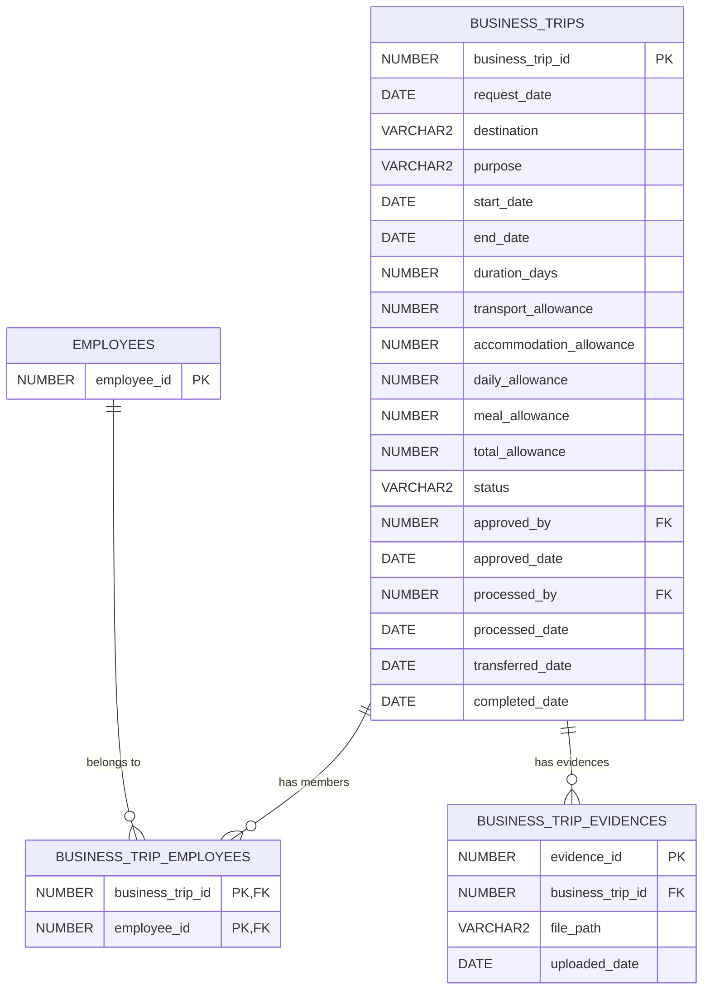

# Analisis Mockup & Desain Database: Business Trip (No 2)

Dokumen ini berisi analisis detail terhadap mockup halaman **Business Trip (Perjalanan Dinas)** (`https://codeid.id/payroll/btrips/user`), desain skema database relasional (Oracle), serta rancangan awal REST API.

---

## 1. Analisis Elemen UI/Mockup
Berdasarkan mockup halaman Business Trip, diidentifikasi komponen-komponen antarmuka dan alur bisnis berikut:

### A. Komponen Filter & Aksi
1. **Filter Periode Tanggal**: Memakai dua input bertipe *Date Picker* (Tanggal Mulai `To` Tanggal Selesai) dan tombol **Search**.
2. **Tombol Add Trips (+)**: Tombol untuk mengajukan perjalanan dinas baru.

### B. Tabel Daftar Perjalanan Dinas (Business Trips Table)
Menampilkan kolom-kolom:
1. **Request Date**: Tanggal pengajuan dibuat (contoh: `05/05/2025`).
2. **Teams**: Daftar nama karyawan yang ikut dalam perjalanan dinas tersebut.
   * *Analisis Penting*: Kolom ini dapat berisi **lebih dari satu karyawan** (contoh baris 1: `Rima`, `Andri`, `Beje`). Ini menandakan hubungan **Many-to-Many** antara Perjalanan Dinas dan Karyawan.
3. **Destination / Purpose**: Rute kota tujuan dan maksud perjalanan dinas (contoh: `JKT-BDG / Training`).
4. **Schedule**: Tanggal keberangkatan, tanggal kepulangan, dan durasi dalam hari (contoh: `07/05/2025` s.d `08/05/2025 (2 days)`).
5. **Total Allowances**: Jumlah total uang saku/tunjangan perjalanan dinas (contoh: `Rp. 2.450.000`).
6. **Status**: Status pengajuan aktif (`New Request`, `Approved`, `Processed`, `Completed`, `Rejected`).
7. **Approved By**: Status persetujuan beserta nama atasan/petugas keuangan (contoh: `Waiting`, `Widi [ Manager ]`, `Annisa [ Finance ]`).
8. **Actions (Icon Tiga Titik $\vdots$)**: Membuka opsi menu:
   * **Edit**: Mengedit pengajuan (aktif jika status `New Request`).
   * **Delete**: Menghapus pengajuan (aktif jika status `New Request`).
   * **Approval**: Memproses persetujuan (khusus atasan/finance).
   * **Upload Evidence**: Mengunggah foto/dokumen bukti perjalanan dinas (aktif jika status `Approved` atau setelahnya).
   * **Details**: Membuka pop-up rincian tunjangan dan histori status.

### C. Pop-up Rincian (Details Modal)
Memiliki dua tab informasi:
1. **Allowances Tab (Tunjangan)**:
   Menampilkan rincian kalkulasi tunjangan perjalanan dinas:
   * *Transport*: Biaya transportasi (e.g. `Rp. 500.000 x 2` $\rightarrow$ pulang-pergi).
   * *Accomodation*: Biaya penginapan dikalikan durasi hari (e.g. `Rp. 350.000 x 3`).
   * *Daily*: Uang harian dikalikan durasi hari (e.g. `Rp. 100.000 x 3`).
   * *Meal*: Uang makan dikalikan durasi hari (e.g. `Rp. 50.000 x 3`).
   * *Total*: Penjumlahan dari semua jenis tunjangan di atas (e.g. `Rp. 2.450.000`).
2. **History Tab (Riwayat Status)**:
   Menampilkan linimasa tanggal perubahan status pengajuan:
   * *Date Request*: Tanggal diajukan.
   * *Approval*: Tanggal disetujui Manager.
   * *Process*: Tanggal diproses oleh Finance.
   * *Transfer*: Tanggal dana ditransfer ke karyawan.
   * *Completed*: Tanggal perjalanan dinas selesai terlaksana.

### D. Modal Unggah Bukti (Upload Evidence Modal)
* Menampilkan grid foto bukti pengeluaran/perjalanan dinas yang telah diunggah.
* Menyediakan tombol **Upload Evidences** untuk menambahkan gambar baru.

---

## 2. Desain Database (Skema Oracle)

Untuk mendukung hubungan **Many-to-Many** pada kolom **Teams** dan rincian tunjangan serta riwayat status, kita membagi data ke dalam 3 tabel:



### Skrip DDL Oracle (Tabel & Sequence)
```sql
-- 1. Sequence untuk ID
CREATE SEQUENCE business_trips_seq START WITH 1 INCREMENT BY 1 NOCACHE;
CREATE SEQUENCE bt_evidences_seq START WITH 1 INCREMENT BY 1 NOCACHE;

-- 2. Tabel Utama: BUSINESS_TRIPS
CREATE TABLE business_trips (
    business_trip_id NUMBER DEFAULT business_trips_seq.NEXTVAL,
    request_date DATE DEFAULT SYSDATE NOT NULL,
    destination VARCHAR2(100) NOT NULL,
    purpose VARCHAR2(255) NOT NULL,
    start_date DATE NOT NULL,
    end_date DATE NOT NULL,
    duration_days NUMBER NOT NULL,
    -- Rincian Tunjangan
    transport_allowance NUMBER(10,2) DEFAULT 0 NOT NULL,
    accommodation_allowance NUMBER(10,2) DEFAULT 0 NOT NULL,
    daily_allowance NUMBER(10,2) DEFAULT 0 NOT NULL,
    meal_allowance NUMBER(10,2) DEFAULT 0 NOT NULL,
    total_allowance NUMBER(10,2) DEFAULT 0 NOT NULL,
    -- Status & Otorisasi
    status VARCHAR2(30) DEFAULT 'New Request' NOT NULL,
    approved_by NUMBER,
    approved_date DATE,
    processed_by NUMBER,
    processed_date DATE,
    transferred_date DATE,
    completed_date DATE,
    -- Constraints
    CONSTRAINT pk_business_trip_id PRIMARY KEY (business_trip_id),
    CONSTRAINT fk_bt_approved_by FOREIGN KEY (approved_by) REFERENCES employees(employee_id) ON DELETE SET NULL,
    CONSTRAINT fk_bt_processed_by FOREIGN KEY (processed_by) REFERENCES employees(employee_id) ON DELETE SET NULL,
    CONSTRAINT chk_bt_status CHECK (status IN ('New Request', 'Approved', 'Processed', 'Completed', 'Rejected'))
);

-- 3. Tabel Junction (Many-to-Many Teams): BUSINESS_TRIP_EMPLOYEES
CREATE TABLE business_trip_employees (
    business_trip_id NUMBER NOT NULL,
    employee_id NUMBER NOT NULL,
    CONSTRAINT pk_bt_emp PRIMARY KEY (business_trip_id, employee_id),
    CONSTRAINT fk_bte_trip_id FOREIGN KEY (business_trip_id) REFERENCES business_trips(business_trip_id) ON DELETE CASCADE,
    CONSTRAINT fk_bte_employee_id FOREIGN KEY (employee_id) REFERENCES employees(employee_id) ON DELETE CASCADE
);

-- 4. Tabel Bukti Perjalanan Dinas: BUSINESS_TRIP_EVIDENCES
CREATE TABLE business_trip_evidences (
    evidence_id NUMBER DEFAULT bt_evidences_seq.NEXTVAL,
    business_trip_id NUMBER NOT NULL,
    file_path VARCHAR2(255) NOT NULL,
    uploaded_date DATE DEFAULT SYSDATE NOT NULL,
    CONSTRAINT pk_bt_evidence_id PRIMARY KEY (evidence_id),
    CONSTRAINT fk_btev_trip_id FOREIGN KEY (business_trip_id) REFERENCES business_trips(business_trip_id) ON DELETE CASCADE
);
```

---

## 3. Desain REST API (Routes)
Untuk memenuhi alur kerja Business Trip, berikut rancangan endpoint Express.js:

1. **`GET /api/v1/business-trips`**: Mengambil daftar perjalanan dinas (mendukung filter `startDate`, `endDate`, `employeeId`).
2. **`GET /api/v1/business-trips/:id`**: Mengambil detail satu perjalanan dinas beserta rincian tunjangan, tim, dan riwayat status.
3. **`POST /api/v1/business-trips`**: Mengajukan perjalanan dinas baru. Menerima array `employeeIds` untuk mendukung *Teams*. Kalkulasi tunjangan dihitung otomatis di backend berdasarkan durasi hari.
4. **`PUT /api/v1/business-trips/:id`**: Mengubah pengajuan perjalanan dinas (hanya untuk status `New Request`).
5. **`PATCH /api/v1/business-trips/:id/approve`**: Melakukan approval (dari status `New Request` ke `Approved` oleh Manager).
6. **`PATCH /api/v1/business-trips/:id/process`**: Memproses pengajuan (dari status `Approved` ke `Processed` oleh Finance).
7. **`POST /api/v1/business-trips/:id/evidences`**: Mengunggah file bukti pengeluaran perjalanan dinas.
8. **`DELETE /api/v1/business-trips/:id`**: Membatalkan/menghapus pengajuan (hanya untuk status `New Request`).
