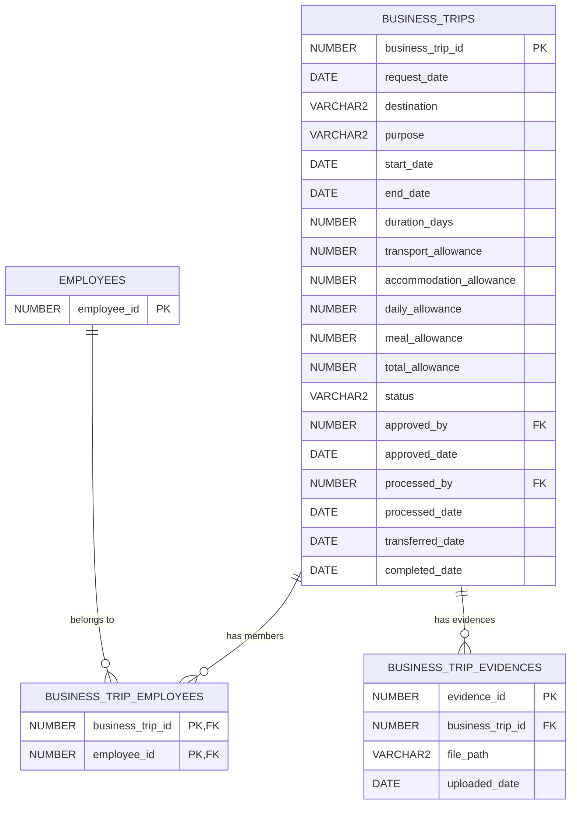

# Panduan Presentasi: Business Trip Module (No 2)

Dokumen ini disusun sebagai panduan presentasi untuk menjelaskan pengerjaan fitur **Business Trip (Perjalanan Dinas)** (Day 04, Task 2), mencakup hasil analisis mockup, desain skema database relasional (Oracle), implementasi backend (Express.js), serta skenario demonstrasi pengujian.

---

## 1. Analisis Mockup & Alur Bisnis (UI Analysis)
Berdasarkan analisis mockup halaman **Business Trip (Perjalanan Dinas)** (`https://codeid.id/payroll/btrips/user`), berikut adalah rincian elemen antarmuka, aturan bisnis, dan alur kerja yang diimplementasikan:

### A. Komponen Filter & Pengajuan Baru
1. **Filter Periode Tanggal**:
   * Menyediakan input *Date Picker* (Tanggal Mulai s.d. Tanggal Selesai) beserta tombol **Search** untuk memfilter riwayat perjalanan dinas berdasarkan rentang waktu pengajuan.
2. **Tombol Add Trips (+)**:
   * Digunakan oleh user/karyawan untuk membuka modal pengajuan perjalanan dinas baru.

### B. Tabel Daftar Perjalanan Dinas (Business Trips Table)
Tabel utama ini menyajikan daftar pengajuan perjalanan dinas dengan kolom-kolom sebagai berikut:
1. **Request Date**: Tanggal pembuatan pengajuan (otomatis terisi tanggal hari ini).
2. **Teams (Anggota Kelompok)**: 
   * **Analisis Relasi**: Kolom ini dapat menampung lebih dari satu nama karyawan yang berpergian bersama (diisikan dalam bentuk koma terpisah, contoh: `Rima, Andri, Beje`). Ini mencerminkan hubungan **Many-to-Many** antara entitas perjalanan dinas dan entitas karyawan.
3. **Destination / Purpose**: Rute kota tujuan dan alasan perjalanan dinas dilakukan (contoh: `JKT-BDG / Training`).
4. **Schedule**: Tanggal mulai, tanggal selesai, serta durasi perjalanan dinas (contoh: `07/05/2025` s.d `08/05/2025 (2 days)`).
5. **Total Allowances**: Akumulasi total biaya tunjangan perjalanan dinas yang dihitung secara otomatis (contoh: `Rp 2.450.000`).
6. **Status**: Status pengajuan aktif (`New Request`, `Approved`, `Processed`, `Completed`, `Rejected`).
7. **Approved By**: Informasi status persetujuan berjenjang (contoh: `Waiting`, `Widi [ Manager ]`, `Annisa [ Finance ]`).
8. **Actions Menu (Icon $\vdots$)**:
   * **Edit & Delete**: Hanya aktif ketika status pengajuan masih `New Request`.
   * **Approval**: Khusus untuk Manager/Finance untuk memproses status persetujuan.
   * **Upload Evidence**: Hanya aktif setelah pengajuan disetujui (status `Approved` atau setelahnya).
   * **Details**: Membuka modal rincian tunjangan dan riwayat status.

### C. Logika Bisnis & Kalkulasi Tunjangan Otomatis (Allowances)
Perhitungan total tunjangan perjalanan dinas dihitung secara dinamis di backend berdasarkan durasi hari perjalanan dinas (rumus durasi hari: `(End Date - Start Date) + 1` hari):
* **Tunjangan Transportasi (Transport)**: Tunjangan flat pulang-pergi sebesar **Rp 1.000.000** (diasumsikan Rp 500.000 untuk sekali jalan pergi, dan Rp 500.000 sekali jalan pulang).
* **Tunjangan Akomodasi (Accommodation)**: Tunjangan penginapan sebesar **Rp 350.000 per hari**, dikalikan durasi hari perjalanan.
* **Tunjangan Harian (Daily Allowance)**: Uang saku harian sebesar **Rp 100.000 per hari**, dikalikan durasi hari perjalanan.
* **Tunjangan Makan (Meal Allowance)**: Uang makan harian sebesar **Rp 50.000 per hari**, dikalikan durasi hari perjalanan.
* **Rumus Total Tunjangan**:
  $$\text{Total Allowance} = \text{Transport} + (\text{Accommodation} \times \text{Days}) + (\text{Daily} \times \text{Days}) + (\text{Meal} \times \text{Days})$$
  * *Contoh Simulasi*: Untuk perjalanan dinas selama **3 hari**:
    $$\text{Total} = \text{Rp 1.000.000} + (3 \times \text{Rp 350.000}) + (3 \times \text{Rp 100.000}) + (3 \times \text{Rp 50.000}) = \text{Rp 2.500.000}$$

### D. Alur Kerja Persetujuan (Workflow & Timeline)
Siklus hidup pengajuan perjalanan dinas diatur oleh alur kerja status berjenjang berikut:
1. **New Request**: Status awal ketika pengajuan baru berhasil disubmit oleh karyawan. Pada status ini, data pengajuan masih bisa di-edit atau dihapus.
2. **Approved (Manager Approval)**: Manager menyetujui pengajuan. Sistem akan merekam ID manager (`approved_by`) dan tanggal persetujuan (`approved_date`).
3. **Processed (Finance Processing)**: Divisi Keuangan memproses pembayaran tunjangan. Sistem merekam ID finance officer (`processed_by`) dan tanggal proses (`processed_date`).
4. **Completed**: Perjalanan dinas telah selesai dilaksanakan.

### E. Pop-up Rincian & Unggah Bukti (Modal Details & Evidences)
1. **Modal Details**:
   * **Tab Allowances**: Menampilkan breakdown detail kalkulasi nominal tunjangan per kategori secara transparan.
   * **Tab History**: Menampilkan timeline/riwayat status dari tanggal request dibuat, tanggal disetujui manager, tanggal diproses finance, tanggal transfer, hingga tanggal completed.
2. **Modal Upload Evidence**:
   * Memungkinkan karyawan mengunggah foto atau dokumen bukti perjalanan dinas (seperti nota hotel, tiket pesawat, dll). Dokumen ini tersimpan dan terelasi dengan data utama business trip.

---

## 2. Struktur Tabel Database (Oracle Schema)
Untuk mengakomodasi requirements di atas, kami mengimplementasikan 3 tabel baru beserta 2 sequence di Oracle DB:
1. **`business_trips`**: Menyimpan data utama perjalanan dinas, status, breakdown tunjangan, serta tracking historis (tanggal approval & pemrosesan).
2. **`business_trip_employees`**: Tabel junction untuk menyimpan relasi many-to-many antara perjalanan dinas dan karyawan anggota tim.
3. **`business_trip_evidences`**: Menyimpan data path/URL gambar bukti pengeluaran perjalanan dinas.

### A. Desain Relasi Database (ER Diagram)
Berikut adalah diagram hubungan antar tabel untuk modul Business Trip:



### B. Sintaks DDL SQL (Oracle)
Berikut adalah skrip SQL untuk membuat database schema dan sequence:

```sql
-- 1. Sequence untuk ID
CREATE SEQUENCE business_trips_seq START WITH 1 INCREMENT BY 1 NOCACHE;
CREATE SEQUENCE bt_evidences_seq START WITH 1 INCREMENT BY 1 NOCACHE;

-- 2. Tabel Utama: BUSINESS_TRIPS
CREATE TABLE business_trips (
    business_trip_id NUMBER DEFAULT business_trips_seq.NEXTVAL,
    request_date DATE DEFAULT SYSDATE NOT NULL,
    destination VARCHAR2(100) NOT NULL,
    purpose VARCHAR2(255) NOT NULL,
    start_date DATE NOT NULL,
    end_date DATE NOT NULL,
    duration_days NUMBER NOT NULL,
    -- Rincian Tunjangan
    transport_allowance NUMBER(10,2) DEFAULT 0 NOT NULL,
    accommodation_allowance NUMBER(10,2) DEFAULT 0 NOT NULL,
    daily_allowance NUMBER(10,2) DEFAULT 0 NOT NULL,
    meal_allowance NUMBER(10,2) DEFAULT 0 NOT NULL,
    total_allowance NUMBER(10,2) DEFAULT 0 NOT NULL,
    -- Status & Otorisasi
    status VARCHAR2(30) DEFAULT 'New Request' NOT NULL,
    approved_by NUMBER,
    approved_date DATE,
    processed_by NUMBER,
    processed_date DATE,
    transferred_date DATE,
    completed_date DATE,
    -- Constraints
    CONSTRAINT pk_business_trip_id PRIMARY KEY (business_trip_id),
    CONSTRAINT fk_bt_approved_by FOREIGN KEY (approved_by) REFERENCES employees(employee_id) ON DELETE SET NULL,
    CONSTRAINT fk_bt_processed_by FOREIGN KEY (processed_by) REFERENCES employees(employee_id) ON DELETE SET NULL,
    CONSTRAINT chk_bt_status CHECK (status IN ('New Request', 'Approved', 'Processed', 'Completed', 'Rejected'))
);

-- 3. Tabel Junction (Many-to-Many Teams): BUSINESS_TRIP_EMPLOYEES
CREATE TABLE business_trip_employees (
    business_trip_id NUMBER NOT NULL,
    employee_id NUMBER NOT NULL,
    CONSTRAINT pk_bt_emp PRIMARY KEY (business_trip_id, employee_id),
    CONSTRAINT fk_bte_trip_id FOREIGN KEY (business_trip_id) REFERENCES business_trips(business_trip_id) ON DELETE CASCADE,
    CONSTRAINT fk_bte_employee_id FOREIGN KEY (employee_id) REFERENCES employees(employee_id) ON DELETE CASCADE
);

-- 4. Tabel Bukti Perjalanan Dinas: BUSINESS_TRIP_EVIDENCES
CREATE TABLE business_trip_evidences (
    evidence_id NUMBER DEFAULT bt_evidences_seq.NEXTVAL,
    business_trip_id NUMBER NOT NULL,
    file_path VARCHAR2(255) NOT NULL,
    uploaded_date DATE DEFAULT SYSDATE NOT NULL,
    CONSTRAINT pk_bt_evidence_id PRIMARY KEY (evidence_id),
    CONSTRAINT fk_btev_trip_id FOREIGN KEY (business_trip_id) REFERENCES business_trips(business_trip_id) ON DELETE CASCADE
);
```

### C. Query Relasi Teams (LISTAGG)
Query relasi teams di dashboard menggunakan fungsi `LISTAGG` Oracle untuk menggabungkan nama anggota tim secara efisien:
```sql
SELECT LISTAGG(e.first_name || ' ' || e.last_name, ', ') WITHIN GROUP (ORDER BY e.first_name)
FROM business_trip_employees bte
JOIN employees e ON bte.employee_id = e.employee_id
...
```

### D. Query untuk Memeriksa Isi Tabel (Select Queries)
Berikut adalah kueri SQL untuk memeriksa isi dari masing-masing tabel yang baru dibuat:

```sql
-- 1. Memeriksa semua data perjalanan dinas
SELECT * FROM business_trips ORDER BY request_date DESC;

-- 2. Memeriksa data relasi perjalanan dinas dengan karyawan (tim)
SELECT * FROM business_trip_employees;

-- 3. Memeriksa data file bukti perjalanan dinas (evidence)
SELECT * FROM business_trip_evidences;

-- 4. Query gabungan untuk melihat detail perjalanan dinas beserta anggota tim dan approver
SELECT 
    bt.business_trip_id,
    bt.destination,
    bt.purpose,
    TO_CHAR(bt.start_date, 'YYYY-MM-DD') AS start_date,
    TO_CHAR(bt.end_date, 'YYYY-MM-DD') AS end_date,
    bt.total_allowance,
    bt.status,
    (
        SELECT LISTAGG(e.first_name || ' ' || e.last_name, ', ') WITHIN GROUP (ORDER BY e.first_name)
        FROM business_trip_employees bte
        JOIN employees e ON bte.employee_id = e.employee_id
        WHERE bte.business_trip_id = bt.business_trip_id
    ) AS team_members
FROM business_trips bt
ORDER BY bt.business_trip_id DESC;
```

### E. Sintaks SQL untuk Menyisipkan 10 Data Dummy (Oracle)
Berikut adalah skrip SQL untuk menginput 10 data dummy secara langsung ke tabel `business_trips` dan tabel relasi `business_trip_employees` menggunakan sequence:

```sql
-- 1. Insert Perjalanan Dinas 1 (Status: New Request)
INSERT INTO business_trips (business_trip_id, request_date, destination, purpose, start_date, end_date, duration_days, transport_allowance, accommodation_allowance, daily_allowance, meal_allowance, total_allowance, status)
VALUES (business_trips_seq.NEXTVAL, TO_DATE('2026-06-01', 'YYYY-MM-DD'), 'Jakarta - Bandung', 'Training Node.js', TO_DATE('2026-06-15', 'YYYY-MM-DD'), TO_DATE('2026-06-16', 'YYYY-MM-DD'), 2, 1000000, 700000, 200000, 100000, 2000000, 'New Request');
INSERT INTO business_trip_employees (business_trip_id, employee_id) VALUES (business_trips_seq.CURRVAL, 100);
INSERT INTO business_trip_employees (business_trip_id, employee_id) VALUES (business_trips_seq.CURRVAL, 101);

-- 2. Insert Perjalanan Dinas 2 (Status: Approved)
INSERT INTO business_trips (business_trip_id, request_date, destination, purpose, start_date, end_date, duration_days, transport_allowance, accommodation_allowance, daily_allowance, meal_allowance, total_allowance, status, approved_by, approved_date)
VALUES (business_trips_seq.NEXTVAL, TO_DATE('2026-06-02', 'YYYY-MM-DD'), 'Surabaya', 'Meeting Client A', TO_DATE('2026-06-18', 'YYYY-MM-DD'), TO_DATE('2026-06-20', 'YYYY-MM-DD'), 3, 1000000, 1050000, 300000, 150000, 2500000, 'Approved', 100, TO_DATE('2026-06-03', 'YYYY-MM-DD'));
INSERT INTO business_trip_employees (business_trip_id, employee_id) VALUES (business_trips_seq.CURRVAL, 102);

-- 3. Insert Perjalanan Dinas 3 (Status: Processed)
INSERT INTO business_trips (business_trip_id, request_date, destination, purpose, start_date, end_date, duration_days, transport_allowance, accommodation_allowance, daily_allowance, meal_allowance, total_allowance, status, approved_by, approved_date, processed_by, processed_date)
VALUES (business_trips_seq.NEXTVAL, TO_DATE('2026-06-03', 'YYYY-MM-DD'), 'Medan', 'Audit Cabang', TO_DATE('2026-06-22', 'YYYY-MM-DD'), TO_DATE('2026-06-25', 'YYYY-MM-DD'), 4, 1000000, 1400000, 400000, 200000, 3000000, 'Processed', 100, TO_DATE('2026-06-04', 'YYYY-MM-DD'), 101, TO_DATE('2026-06-05', 'YYYY-MM-DD'));
INSERT INTO business_trip_employees (business_trip_id, employee_id) VALUES (business_trips_seq.CURRVAL, 103);
INSERT INTO business_trip_employees (business_trip_id, employee_id) VALUES (business_trips_seq.CURRVAL, 104);
-- Evidence Bukti Perjalanan (Nota Pengeluaran)
INSERT INTO business_trip_evidences (evidence_id, business_trip_id, file_path, uploaded_date)
VALUES (bt_evidences_seq.NEXTVAL, business_trips_seq.CURRVAL, 'uploads/evidences/audit_medan_receipt.jpg', TO_DATE('2026-06-05', 'YYYY-MM-DD'));

-- 4. Insert Perjalanan Dinas 4 (Status: Completed)
INSERT INTO business_trips (business_trip_id, request_date, destination, purpose, start_date, end_date, duration_days, transport_allowance, accommodation_allowance, daily_allowance, meal_allowance, total_allowance, status, approved_by, approved_date, processed_by, processed_date, completed_date)
VALUES (business_trips_seq.NEXTVAL, TO_DATE('2026-05-10', 'YYYY-MM-DD'), 'Yogyakarta', 'Seminar Nasional', TO_DATE('2026-05-15', 'YYYY-MM-DD'), TO_DATE('2026-05-19', 'YYYY-MM-DD'), 5, 1000000, 1750000, 500000, 250000, 3500000, 'Completed', 100, TO_DATE('2026-05-11', 'YYYY-MM-DD'), 101, TO_DATE('2026-05-12', 'YYYY-MM-DD'), TO_DATE('2026-05-20', 'YYYY-MM-DD'));
INSERT INTO business_trip_employees (business_trip_id, employee_id) VALUES (business_trips_seq.CURRVAL, 105);
-- Evidence Bukti Perjalanan (Tiket & Hotel)
INSERT INTO business_trip_evidences (evidence_id, business_trip_id, file_path, uploaded_date)
VALUES (bt_evidences_seq.NEXTVAL, business_trips_seq.CURRVAL, 'uploads/evidences/seminar_ticket.jpg', TO_DATE('2026-05-20', 'YYYY-MM-DD'));
INSERT INTO business_trip_evidences (evidence_id, business_trip_id, file_path, uploaded_date)
VALUES (bt_evidences_seq.NEXTVAL, business_trips_seq.CURRVAL, 'uploads/evidences/hotel_bill.jpg', TO_DATE('2026-05-20', 'YYYY-MM-DD'));

-- 5. Insert Perjalanan Dinas 5 (Status: Rejected)
INSERT INTO business_trips (business_trip_id, request_date, destination, purpose, start_date, end_date, duration_days, transport_allowance, accommodation_allowance, daily_allowance, meal_allowance, total_allowance, status, approved_by, approved_date, notes)
VALUES (business_trips_seq.NEXTVAL, TO_DATE('2026-06-05', 'YYYY-MM-DD'), 'Bali', 'Rekreasi Tim (Rejected)', TO_DATE('2026-06-28', 'YYYY-MM-DD'), TO_DATE('2026-06-29', 'YYYY-MM-DD'), 2, 1000000, 700000, 200000, 100000, 2000000, 'Rejected', 100, TO_DATE('2026-06-06', 'YYYY-MM-DD'), 'Anggaran perjalanan dinas tidak mencukupi');
INSERT INTO business_trip_employees (business_trip_id, employee_id) VALUES (business_trips_seq.CURRVAL, 106);

-- 6. Insert Perjalanan Dinas 6 (Status: New Request)
INSERT INTO business_trips (business_trip_id, request_date, destination, purpose, start_date, end_date, duration_days, transport_allowance, accommodation_allowance, daily_allowance, meal_allowance, total_allowance, status)
VALUES (business_trips_seq.NEXTVAL, TO_DATE('2026-06-06', 'YYYY-MM-DD'), 'Semarang', 'Kunjungan Lapangan', TO_DATE('2026-07-02', 'YYYY-MM-DD'), TO_DATE('2026-07-04', 'YYYY-MM-DD'), 3, 1000000, 1050000, 300000, 150000, 2500000, 'New Request');
INSERT INTO business_trip_employees (business_trip_id, employee_id) VALUES (business_trips_seq.CURRVAL, 107);

-- 7. Insert Perjalanan Dinas 7 (Status: New Request)
INSERT INTO business_trips (business_trip_id, request_date, destination, purpose, start_date, end_date, duration_days, transport_allowance, accommodation_allowance, daily_allowance, meal_allowance, total_allowance, status)
VALUES (business_trips_seq.NEXTVAL, TO_DATE('2026-06-07', 'YYYY-MM-DD'), 'Makassar', 'Instalasi Server', TO_DATE('2026-07-05', 'YYYY-MM-DD'), TO_DATE('2026-07-07', 'YYYY-MM-DD'), 3, 1000000, 1050000, 300000, 150000, 2500000, 'New Request');
INSERT INTO business_trip_employees (business_trip_id, employee_id) VALUES (business_trips_seq.CURRVAL, 108);

-- 8. Insert Perjalanan Dinas 8 (Status: Approved)
INSERT INTO business_trips (business_trip_id, request_date, destination, purpose, start_date, end_date, duration_days, transport_allowance, accommodation_allowance, daily_allowance, meal_allowance, total_allowance, status, approved_by, approved_date)
VALUES (business_trips_seq.NEXTVAL, TO_DATE('2026-06-08', 'YYYY-MM-DD'), 'Balikpapan', 'Evaluasi Proyek', TO_DATE('2026-07-10', 'YYYY-MM-DD'), TO_DATE('2026-07-11', 'YYYY-MM-DD'), 2, 1000000, 700000, 200000, 100000, 2000000, 'Approved', 100, TO_DATE('2026-06-09', 'YYYY-MM-DD'));
INSERT INTO business_trip_employees (business_trip_id, employee_id) VALUES (business_trips_seq.CURRVAL, 109);
-- Evidence Bukti Perjalanan (Kwitansi Perjalanan)
INSERT INTO business_trip_evidences (evidence_id, business_trip_id, file_path, uploaded_date)
VALUES (bt_evidences_seq.NEXTVAL, business_trips_seq.CURRVAL, 'uploads/evidences/travel_invoice.jpg', TO_DATE('2026-06-09', 'YYYY-MM-DD'));

-- 9. Insert Perjalanan Dinas 9 (Status: Processed)
INSERT INTO business_trips (business_trip_id, request_date, destination, purpose, start_date, end_date, duration_days, transport_allowance, accommodation_allowance, daily_allowance, meal_allowance, total_allowance, status, approved_by, approved_date, processed_by, processed_date)
VALUES (business_trips_seq.NEXTVAL, TO_DATE('2026-06-09', 'YYYY-MM-DD'), 'Palembang', 'Penandatanganan MOU', TO_DATE('2026-07-15', 'YYYY-MM-DD'), TO_DATE('2026-07-16', 'YYYY-MM-DD'), 2, 1000000, 700000, 200000, 100000, 2000000, 'Processed', 100, TO_DATE('2026-06-10', 'YYYY-MM-DD'), 101, TO_DATE('2026-06-10', 'YYYY-MM-DD'));
INSERT INTO business_trip_employees (business_trip_id, employee_id) VALUES (business_trips_seq.CURRVAL, 100);
-- Evidence Bukti Perjalanan (Foto Penandatanganan)
INSERT INTO business_trip_evidences (evidence_id, business_trip_id, file_path, uploaded_date)
VALUES (bt_evidences_seq.NEXTVAL, business_trips_seq.CURRVAL, 'uploads/evidences/mou_signing_photo.jpg', TO_DATE('2026-06-10', 'YYYY-MM-DD'));

-- 10. Insert Perjalanan Dinas 10 (Status: New Request)
INSERT INTO business_trips (business_trip_id, request_date, destination, purpose, start_date, end_date, duration_days, transport_allowance, accommodation_allowance, daily_allowance, meal_allowance, total_allowance, status)
VALUES (business_trips_seq.NEXTVAL, TO_DATE('2026-06-10', 'YYYY-MM-DD'), 'Denpasar', 'Konferensi Tahunan', TO_DATE('2026-07-20', 'YYYY-MM-DD'), TO_DATE('2026-07-22', 'YYYY-MM-DD'), 3, 1000000, 1050000, 300000, 150000, 2500000, 'New Request');
INSERT INTO business_trip_employees (business_trip_id, employee_id) VALUES (business_trips_seq.CURRVAL, 101);
INSERT INTO business_trip_employees (business_trip_id, employee_id) VALUES (business_trips_seq.CURRVAL, 102);

COMMIT;
```

---

## 3. Implementasi Kode Sumber (Source Code)

Implementasi menggunakan pola **Layered Architecture** di Node.js/Express.js, memisahkan tanggung jawab antara database query, aturan bisnis/transaksi, controller, dan router:

### A. Hubungan Query Oracle (Repository Layer)
Lokasi File: [businessTripRepository.js](file:///e:/Bootcamp/Code%20ID%202026/03.%20Express/express-hr-simple-api/src/repositories/businessTripRepository.js)
```javascript
const { oracledb, getConnection } = require("../utils/db");

class BusinessTripRepository {
  async findAll(filters = {}) {
    let conn;
    try {
      conn = await getConnection();
      
      let query = `
        SELECT 
          bt.business_trip_id AS "businessTripId",
          TO_CHAR(bt.request_date, 'YYYY-MM-DD') AS "requestDate",
          bt.destination AS "destination",
          bt.purpose AS "purpose",
          TO_CHAR(bt.start_date, 'YYYY-MM-DD') AS "startDate",
          TO_CHAR(bt.end_date, 'YYYY-MM-DD') AS "endDate",
          bt.duration_days AS "durationDays",
          bt.total_allowance AS "totalAllowance",
          bt.status AS "status",
          bt.approved_by AS "approvedBy",
          bt.notes AS "notes",
          app.first_name || ' ' || app.last_name AS "approverName",
          (
            SELECT LISTAGG(e.first_name || ' ' || e.last_name, ', ') WITHIN GROUP (ORDER BY e.first_name)
            FROM business_trip_employees bte
            JOIN employees e ON bte.employee_id = e.employee_id
            WHERE bte.business_trip_id = bt.business_trip_id
          ) AS "teams"
        FROM business_trips bt
        LEFT JOIN employees app ON bt.approved_by = app.employee_id
        WHERE 1=1
      `;
      
      const binds = {};
      
      if (filters.employeeId) {
        query += ` AND EXISTS (
          SELECT 1 
          FROM business_trip_employees bte2 
          WHERE bte2.business_trip_id = bt.business_trip_id 
            AND bte2.employee_id = :employeeId
        )`;
        binds.employeeId = Number(filters.employeeId);
      }
      
      if (filters.startDate && filters.endDate) {
        query += ` AND bt.request_date BETWEEN TO_DATE(:startDate, 'YYYY-MM-DD') AND TO_DATE(:endDate, 'YYYY-MM-DD')`;
        binds.startDate = filters.startDate;
        binds.endDate = filters.endDate;
      }
      
      query += ` ORDER BY bt.request_date DESC, bt.business_trip_id DESC`;
      
      const result = await conn.execute(query, binds);
      return result.rows;
    } finally {
      if (conn) await conn.close();
    }
  }

  async findById(id) {
    let conn;
    try {
      conn = await getConnection();
      const tripQuery = `
        SELECT 
          bt.business_trip_id AS "businessTripId",
          TO_CHAR(bt.request_date, 'YYYY-MM-DD') AS "requestDate",
          bt.destination AS "destination",
          bt.purpose AS "purpose",
          TO_CHAR(bt.start_date, 'YYYY-MM-DD') AS "startDate",
          TO_CHAR(bt.end_date, 'YYYY-MM-DD') AS "endDate",
          bt.duration_days AS "durationDays",
          -- Allowances
          bt.transport_allowance AS "transportAllowance",
          bt.accommodation_allowance AS "accommodationAllowance",
          bt.daily_allowance AS "dailyAllowance",
          bt.meal_allowance AS "mealAllowance",
          bt.total_allowance AS "totalAllowance",
          bt.notes AS "notes",
          -- Workflow status
          bt.status AS "status",
          bt.approved_by AS "approvedBy",
          app.first_name || ' ' || app.last_name AS "approverName",
          TO_CHAR(bt.approved_date, 'YYYY-MM-DD') AS "approvedDate",
          bt.processed_by AS "processedBy",
          prc.first_name || ' ' || prc.last_name AS "processorName",
          TO_CHAR(bt.processed_date, 'YYYY-MM-DD') AS "processedDate",
          TO_CHAR(bt.transferred_date, 'YYYY-MM-DD') AS "transferredDate",
          TO_CHAR(bt.completed_date, 'YYYY-MM-DD') AS "completedDate"
        FROM business_trips bt
        LEFT JOIN employees app ON bt.approved_by = app.employee_id
        LEFT JOIN employees prc ON bt.processed_by = prc.employee_id
        WHERE bt.business_trip_id = :id
      `;
      const tripResult = await conn.execute(tripQuery, [Number(id)]);
      const trip = tripResult.rows[0];
      
      if (!trip) return null;

      // Ambil anggota tim (teams)
      const membersQuery = `
        SELECT 
          bte.employee_id AS "employeeId",
          e.first_name || ' ' || e.last_name AS "employeeName"
        FROM business_trip_employees bte
        JOIN employees e ON bte.employee_id = e.employee_id
        WHERE bte.business_trip_id = :id
      `;
      const membersResult = await conn.execute(membersQuery, [Number(id)]);
      trip.employees = membersResult.rows;

      // Ambil bukti perjalanan (evidences)
      const evidencesQuery = `
        SELECT 
          evidence_id AS "evidenceId",
          file_path AS "filePath",
          TO_CHAR(uploaded_date, 'YYYY-MM-DD') AS "uploadedDate"
        FROM business_trip_evidences
        WHERE business_trip_id = :id
      `;
      const evidencesResult = await conn.execute(evidencesQuery, [Number(id)]);
      trip.evidences = evidencesResult.rows;

      return trip;
    } finally {
      if (conn) await conn.close();
    }
  }

  async create(conn, data) {
    const query = `
      INSERT INTO business_trips (
        business_trip_id,
        destination,
        purpose,
        start_date,
        end_date,
        duration_days,
        transport_allowance,
        accommodation_allowance,
        daily_allowance,
        meal_allowance,
        total_allowance,
        status
      ) VALUES (
        business_trips_seq.NEXTVAL,
        :destination,
        :purpose,
        TO_DATE(:startDate, 'YYYY-MM-DD'),
        TO_DATE(:endDate, 'YYYY-MM-DD'),
        :durationDays,
        :transportAllowance,
        :accommodationAllowance,
        :dailyAllowance,
        :mealAllowance,
        :totalAllowance,
        'New Request'
      ) RETURNING business_trip_id INTO :id
    `;
    
    const result = await conn.execute(query, {
      destination: data.destination,
      purpose: data.purpose,
      startDate: data.startDate,
      endDate: data.endDate,
      durationDays: Number(data.durationDays),
      transportAllowance: Number(data.transportAllowance),
      accommodationAllowance: Number(data.accommodationAllowance),
      dailyAllowance: Number(data.dailyAllowance),
      mealAllowance: Number(data.mealAllowance),
      totalAllowance: Number(data.totalAllowance),
      id: { type: oracledb.NUMBER, dir: oracledb.BIND_OUT }
    });
    
    return result.outBinds.id[0];
  }

  async addMembers(conn, businessTripId, employeeIds) {
    const query = `
      INSERT INTO business_trip_employees (business_trip_id, employee_id)
      VALUES (:businessTripId, :employeeId)
    `;
    for (const employeeId of employeeIds) {
      await conn.execute(query, {
        businessTripId: Number(businessTripId),
        employeeId: Number(employeeId)
      });
    }
  }

  async clearMembers(conn, businessTripId) {
    const query = `DELETE FROM business_trip_employees WHERE business_trip_id = :businessTripId`;
    await conn.execute(query, { businessTripId: Number(businessTripId) });
  }

  async update(conn, id, data) {
    const query = `
      UPDATE business_trips
      SET 
        destination = COALESCE(:destination, destination),
        purpose = COALESCE(:purpose, purpose),
        start_date = COALESCE(TO_DATE(:startDate, 'YYYY-MM-DD'), start_date),
        end_date = COALESCE(TO_DATE(:endDate, 'YYYY-MM-DD'), end_date),
        duration_days = COALESCE(:durationDays, duration_days),
        transport_allowance = COALESCE(:transportAllowance, transport_allowance),
        accommodation_allowance = COALESCE(:accommodationAllowance, accommodation_allowance),
        daily_allowance = COALESCE(:dailyAllowance, daily_allowance),
        meal_allowance = COALESCE(:mealAllowance, meal_allowance),
        total_allowance = COALESCE(:totalAllowance, total_allowance)
      WHERE business_trip_id = :id
    `;
    
    const result = await conn.execute(query, {
      id: Number(id),
      destination: data.destination || null,
      purpose: data.purpose || null,
      startDate: data.startDate || null,
      endDate: data.endDate || null,
      durationDays: data.durationDays ? Number(data.durationDays) : null,
      transportAllowance: data.transportAllowance ? Number(data.transportAllowance) : null,
      accommodationAllowance: data.accommodationAllowance ? Number(data.accommodationAllowance) : null,
      dailyAllowance: data.dailyAllowance ? Number(data.dailyAllowance) : null,
      mealAllowance: data.mealAllowance ? Number(data.mealAllowance) : null,
      totalAllowance: data.totalAllowance ? Number(data.totalAllowance) : null
    });
    
    return result.rowsAffected > 0;
  }

  async updateStatus(conn, id, updateData) {
    let query = `UPDATE business_trips SET status = :status`;
    const binds = { id: Number(id), status: updateData.status };

    if (updateData.approvedBy) {
      query += `, approved_by = :approvedBy, approved_date = SYSDATE`;
      binds.approvedBy = Number(updateData.approvedBy);
    }
    if (updateData.notes !== undefined) {
      query += `, notes = :notes`;
      binds.notes = updateData.notes;
    }
    if (updateData.processedBy) {
      query += `, processed_by = :processedBy, processed_date = SYSDATE`;
      binds.processedBy = Number(updateData.processedBy);
    }
    if (updateData.transferredDate) {
      query += `, transferred_date = TO_DATE(:transferredDate, 'YYYY-MM-DD')`;
      binds.transferredDate = updateData.transferredDate;
    }
    if (updateData.completedDate) {
      query += `, completed_date = TO_DATE(:completedDate, 'YYYY-MM-DD')`;
      binds.completedDate = updateData.completedDate;
    }

    query += ` WHERE business_trip_id = :id`;
    const result = await conn.execute(query, binds);
    return result.rowsAffected > 0;
  }

  async addEvidence(conn, businessTripId, filePath) {
    const query = `
      INSERT INTO business_trip_evidences (
        evidence_id,
        business_trip_id,
        file_path
      ) VALUES (
        bt_evidences_seq.NEXTVAL,
        :businessTripId,
        :filePath
      )
    `;
    await conn.execute(query, {
      businessTripId: Number(businessTripId),
      filePath
    });
  }

  async delete(conn, id) {
    const query = `DELETE FROM business_trips WHERE business_trip_id = :id`;
    const result = await conn.execute(query, { id: Number(id) });
    return result.rowsAffected > 0;
  }
}

module.exports = new BusinessTripRepository();
```

### B. Logika Bisnis & Transaksi (Service Layer)
Lokasi File: [businessTripService.js](file:///e:/Bootcamp/Code%20ID%202026/03.%20Express/express-hr-simple-api/src/services/businessTripService.js)
```javascript
const businessTripRepository = require("../repositories/businessTripRepository");
const employeeRepository = require("../repositories/employeeRepository");
const { BadRequestError, NotFoundError } = require("../utils/customError");
const { getConnection } = require("../utils/db");

class BusinessTripService {
  ALLOWANCES = {
    TRANSPORT_RATE: 500000,
    ACCOMMODATION_RATE: 350000,
    DAILY_RATE: 100000,
    MEAL_RATE: 50000
  };

  calculateDurationDays(startDate, endDate) {
    const start = new Date(startDate);
    const end = new Date(endDate);
    if (isNaN(start) || isNaN(end) || start > end) {
      throw new BadRequestError("Invalid start or end date.");
    }
    const diffTime = Math.abs(end - start);
    return Math.ceil(diffTime / (1000 * 60 * 60 * 24)) + 1;
  }

  calculateAllowances(durationDays) {
    const transportAllowance = this.ALLOWANCES.TRANSPORT_RATE * 2;
    const accommodationAllowance = this.ALLOWANCES.ACCOMMODATION_RATE * durationDays;
    const dailyAllowance = this.ALLOWANCES.DAILY_RATE * durationDays;
    const mealAllowance = this.ALLOWANCES.MEAL_RATE * durationDays;
    const totalAllowance = transportAllowance + accommodationAllowance + dailyAllowance + mealAllowance;

    return {
      transportAllowance,
      accommodationAllowance,
      dailyAllowance,
      mealAllowance,
      totalAllowance
    };
  }

  async getAllTrips(filters) {
    return await businessTripRepository.findAll(filters);
  }

  async getTripById(id) {
    const trip = await businessTripRepository.findById(id);
    if (!trip) {
      throw new NotFoundError(`Business Trip with ID ${id} not found.`);
    }
    return trip;
  }

  async requestTrip(data) {
    for (const empId of data.employeeIds) {
      const empExists = await employeeRepository.findById(empId);
      if (!empExists) {
        throw new NotFoundError(`Employee with ID ${empId} not found in the team.`);
      }
    }

    const durationDays = this.calculateDurationDays(data.startDate, data.endDate);
    const allowances = this.calculateAllowances(durationDays);

    const tripData = {
      destination: data.destination,
      purpose: data.purpose,
      startDate: data.startDate,
      endDate: data.endDate,
      durationDays,
      ...allowances
    };

    let conn;
    try {
      conn = await getConnection();
      const businessTripId = await businessTripRepository.create(conn, tripData);
      await businessTripRepository.addMembers(conn, businessTripId, data.employeeIds);
      await conn.commit();
      
      return {
        businessTripId,
        destination: data.destination,
        durationDays,
        totalAllowance: allowances.totalAllowance,
        status: 'New Request'
      };
    } catch (error) {
      if (conn) await conn.rollback();
      throw error;
    } finally {
      if (conn) await conn.close();
    }
  }

  async updateTrip(id, data) {
    const trip = await businessTripRepository.findById(id);
    if (!trip) {
      throw new NotFoundError(`Business Trip with ID ${id} not found.`);
    }

    if (trip.status !== 'New Request') {
      throw new BadRequestError(`Only business trips with 'New Request' status can be modified.`);
    }

    if (data.employeeIds) {
      for (const empId of data.employeeIds) {
        const empExists = await employeeRepository.findById(empId);
        if (!empExists) {
          throw new NotFoundError(`Employee with ID ${empId} not found in the team.`);
        }
      }
    }

    const startDate = data.startDate || trip.startDate;
    const endDate = data.endDate || trip.endDate;
    const durationDays = this.calculateDurationDays(startDate, endDate);
    const allowances = this.calculateAllowances(durationDays);

    const tripData = {
      destination: data.destination || null,
      purpose: data.purpose || null,
      startDate: data.startDate || null,
      endDate: data.endDate || null,
      durationDays,
      ...allowances
    };

    let conn;
    try {
      conn = await getConnection();
      const success = await businessTripRepository.update(conn, id, tripData);
      if (!success) {
        throw new NotFoundError(`Business Trip with ID ${id} not found.`);
      }

      if (data.employeeIds) {
        await businessTripRepository.clearMembers(conn, id);
        await businessTripRepository.addMembers(conn, id, data.employeeIds);
      }

      await conn.commit();
      return await businessTripRepository.findById(id);
    } catch (error) {
      if (conn) await conn.rollback();
      throw error;
    } finally {
      if (conn) await conn.close();
    }
  }

  async approveTrip(id, { approvedBy, status, notes }) {
    if (!['Approved', 'Rejected'].includes(status)) {
      throw new BadRequestError(`Status must be either 'Approved' or 'Rejected'.`);
    }

    const trip = await businessTripRepository.findById(id);
    if (!trip) {
      throw new NotFoundError(`Business Trip with ID ${id} not found.`);
    }

    if (trip.status !== 'New Request') {
      throw new BadRequestError(`Only trips in 'New Request' status can be approved or rejected.`);
    }

    const approver = await employeeRepository.findById(approvedBy);
    if (!approver) {
      throw new NotFoundError(`Approver employee with ID ${approvedBy} not found.`);
    }

    let conn;
    try {
      conn = await getConnection();
      const success = await businessTripRepository.updateStatus(conn, id, {
        status,
        approvedBy,
        notes
      });
      if (!success) {
        throw new NotFoundError(`Business Trip with ID ${id} not found.`);
      }
      await conn.commit();
      return await businessTripRepository.findById(id);
    } catch (error) {
      if (conn) await conn.rollback();
      throw error;
    } finally {
      if (conn) await conn.close();
    }
  }

  async processTrip(id, processedBy) {
    const trip = await businessTripRepository.findById(id);
    if (!trip) {
      throw new NotFoundError(`Business Trip with ID ${id} not found.`);
    }

    if (trip.status !== 'Approved') {
      throw new BadRequestError(`Only approved trips can be processed by finance.`);
    }

    const processor = await employeeRepository.findById(processedBy);
    if (!processor) {
      throw new NotFoundError(`Finance officer with ID ${processedBy} not found.`);
    }

    let conn;
    try {
      conn = await getConnection();
      const success = await businessTripRepository.updateStatus(conn, id, {
        status: 'Processed',
        processedBy
      });
      if (!success) {
        throw new NotFoundError(`Business Trip with ID ${id} not found.`);
      }
      await conn.commit();
      return await businessTripRepository.findById(id);
    } catch (error) {
      if (conn) await conn.rollback();
      throw error;
    } finally {
      if (conn) await conn.close();
    }
  }

  async uploadEvidence(id, filePath) {
    const trip = await businessTripRepository.findById(id);
    if (!trip) {
      throw new NotFoundError(`Business Trip with ID ${id} not found.`);
    }

    if (!['Approved', 'Processed', 'Completed'].includes(trip.status)) {
      throw new BadRequestError("Evidences can only be uploaded for Approved, Processed, or Completed trips.");
    }

    let conn;
    try {
      conn = await getConnection();
      await businessTripRepository.addEvidence(conn, id, filePath);
      await conn.commit();
      return await businessTripRepository.findById(id);
    } catch (error) {
      if (conn) await conn.rollback();
      throw error;
    } finally {
      if (conn) await conn.close();
    }
  }

  async deleteTrip(id) {
    const trip = await businessTripRepository.findById(id);
    if (!trip) {
      throw new NotFoundError(`Business Trip with ID ${id} not found.`);
    }

    if (trip.status !== 'New Request') {
      throw new BadRequestError(`Only business trips with 'New Request' status can be deleted.`);
    }

    let conn;
    try {
      conn = await getConnection();
      const success = await businessTripRepository.delete(conn, id);
      if (!success) {
        throw new NotFoundError(`Business Trip with ID ${id} not found.`);
      }
      await conn.commit();
      return true;
    } catch (error) {
      if (conn) await conn.rollback();
      throw error;
    } finally {
      if (conn) await conn.close();
    }
  }
}

module.exports = new BusinessTripService();
```

### C. Mapping Express (Controller Layer)
Lokasi File: [businessTripController.js](file:///e:/Bootcamp/Code%20ID%202026/03.%20Express/express-hr-simple-api/src/controllers/businessTripController.js)
```javascript
const businessTripService = require("../services/businessTripService");

class BusinessTripController {
  findAll = async (req, res, next) => {
    try {
      const { employeeId, startDate, endDate } = req.query;
      const data = await businessTripService.getAllTrips({ employeeId, startDate, endDate });
      return res.success("Business Trips retrieved successfully", data);
    } catch (error) {
      next(error);
    }
  };

  findById = async (req, res, next) => {
    try {
      const { id } = req.params;
      const data = await businessTripService.getTripById(id);
      return res.success("Business Trip retrieved successfully", data);
    } catch (error) {
      next(error);
    }
  };

  create = async (req, res, next) => {
    try {
      const data = await businessTripService.requestTrip(req.body);
      return res.success("Business Trip request submitted successfully", data, 201);
    } catch (error) {
      next(error);
    }
  };

  update = async (req, res, next) => {
    try {
      const { id } = req.params;
      const data = await businessTripService.updateTrip(id, req.body);
      return res.success("Business Trip request updated successfully", data);
    } catch (error) {
      next(error);
    }
  };

  approve = async (req, res, next) => {
    try {
      const { id } = req.params;
      const { approvedBy, status, notes } = req.body;
      const data = await businessTripService.approveTrip(id, { approvedBy, status, notes });
      return res.success("Business Trip approval status updated successfully", data);
    } catch (error) {
      next(error);
    }
  };

  process = async (req, res, next) => {
    try {
      const { id } = req.params;
      const { processedBy } = req.body;
      const data = await businessTripService.processTrip(id, processedBy);
      return res.success("Business Trip processed successfully", data);
    } catch (error) {
      next(error);
    }
  };

  uploadEvidence = async (req, res, next) => {
    try {
      const { id } = req.params;
      const { filePath } = req.body;
      const data = await businessTripService.uploadEvidence(id, filePath);
      return res.success("Evidence uploaded successfully", data);
    } catch (error) {
      next(error);
    }
  };

  remove = async (req, res, next) => {
    try {
      const { id } = req.params;
      await businessTripService.deleteTrip(id);
      return res.success("Business Trip request deleted successfully", null);
    } catch (error) {
      next(error);
    }
  };
}

module.exports = new BusinessTripController();
```

### D. Jalur Endpoint (Routing Layer)
Lokasi File: [businessTripRoute.js](file:///e:/Bootcamp/Code%20ID%202026/03.%20Express/express-hr-simple-api/src/routes/businessTripRoute.js)
```javascript
const express = require("express");
const router = express.Router();

const businessTripController = require("../controllers/businessTripController");

router.get("/", businessTripController.findAll);
router.get("/:id", businessTripController.findById);
router.post("/", businessTripController.create);
router.put("/:id", businessTripController.update);
router.patch("/:id/approve", businessTripController.approve);
router.patch("/:id/process", businessTripController.process);
router.post("/:id/evidences", businessTripController.uploadEvidence);
router.delete("/:id", businessTripController.remove);

module.exports = router;
```

Registrasi Route Baru pada File Routing Utama `src/routes/index.js`:
```javascript
const businessTripRoutes = require('./businessTripRoute');
router.use('/business-trips', businessTripRoutes);
```

---

## 4. Prosedur & Hasil Pengujian Menggunakan Postman (Lengkap)

Untuk menguji semua endpoint secara manual melalui Postman, jalankan server Express terlebih dahulu:
```bash
npm run dev
```
Secara default, server akan berjalan di `http://localhost:3000` dengan prefix API `/api` (sehingga base URL pengujian adalah `http://localhost:3000/api/business-trips`).

Berikut adalah struktur koleksi request Postman beserta contoh request dan response untuk skenario sukses maupun gagal:

---

#### 1. POST - Mengajukan Perjalanan Dinas Baru (Create)
Digunakan untuk merekam data pengajuan perjalanan dinas beserta anggota timnya (relasi Many-to-Many). Total tunjangan otomatis dihitung di backend berdasarkan selisih hari.

* **URL**: `POST http://localhost:3000/api/business-trips`
* **Headers**: 
  * `Content-Type: application/json`
* **Skenario A: Sukses (Karyawan Terdaftar)**
  * **Request Body (JSON)**:
    ```json
    {
      "destination": "Surabaya",
      "purpose": "Meeting dengan Client A",
      "startDate": "2026-06-18",
      "endDate": "2026-06-20",
      "employeeIds": [100, 101]
    }
    ```
  * **Expected Response (201 Created)**:
    ```json
    {
      "success": true,
      "message": "Business Trip request submitted successfully",
      "data": {
        "businessTripId": 1,
        "destination": "Surabaya",
        "durationDays": 3,
        "totalAllowance": 2500000,
        "status": "New Request"
      }
    }
    ```
* **Skenario B: Gagal - Anggota Tim Tidak Terdaftar (Integrity Constraint)**
  * **Request Body (JSON)**:
    ```json
    {
      "destination": "Surabaya",
      "purpose": "Meeting dengan Client A",
      "startDate": "2026-06-18",
      "endDate": "2026-06-20",
      "employeeIds": [9999]
    }
    ```
  * **Expected Response (404 Not Found)**:
    ```json
    {
      "success": false,
      "message": "Employee with ID 9999 not found in the team."
    }
    ```

---

#### 2. GET - Mengambil Semua / Daftar Perjalanan Dinas (Find All & Read)
Digunakan untuk mengambil seluruh riwayat perjalanan dinas (Find All) atau memfilter berdasarkan parameter Tanggal Periode (`startDate`, `endDate`) dan ID Karyawan.

* **Skenario A: Mengambil Semua Daftar Perjalanan Dinas**
  * **URL**: `GET http://localhost:3000/api/business-trips`
  * **Expected Response (200 OK)**:
    ```json
    {
      "success": true,
      "message": "Business Trips retrieved successfully",
      "data": [
        {
          "businessTripId": 1,
          "requestDate": "2026-06-11",
          "destination": "Surabaya",
          "purpose": "Meeting dengan Client A",
          "startDate": "2026-06-18",
          "endDate": "2026-06-20",
          "durationDays": 3,
          "totalAllowance": 2500000,
          "status": "New Request",
          "approvedBy": null,
          "notes": null,
          "approverName": " ",
          "teams": "Steven King, Neena Kochhar"
        }
      ]
    }
    ```
* **Skenario B: Mengambil Daftar Perjalanan Dinas dengan Filter**
  * **URL**: `GET http://localhost:3000/api/business-trips`
  * **Query Parameters (Params)**:
    * `employeeId`: `100` (Filter untuk menampilkan perjalanan dinas yang diikuti oleh karyawan dengan ID 100)
    * `startDate`: `2026-06-01`
    * `endDate`: `2026-06-30`
  * *Catatan Logika Filter*: Meskipun kolom `employee_id` tidak ada secara langsung di tabel `business_trips`, filter `employeeId` tetap bekerja karena di level repository backend, kueri SQL menggunakan klausa `EXISTS` untuk mencocokkannya ke tabel relasi/junction `business_trip_employees`.
  * **Expected Response (200 OK)**:
    ```json
    {
      "success": true,
      "message": "Business Trips retrieved successfully",
      "data": [
        {
          "businessTripId": 1,
          "requestDate": "2026-06-11",
          "destination": "Surabaya",
          "purpose": "Meeting dengan Client A",
          "startDate": "2026-06-18",
          "endDate": "2026-06-20",
          "durationDays": 3,
          "totalAllowance": 2500000,
          "status": "New Request",
          "approvedBy": null,
          "notes": null,
          "approverName": " ",
          "teams": "Steven King, Neena Kochhar"
        }
      ]
    }
    ```

---

#### 3. GET - Mengambil Detail Perjalanan Dinas Berdasarkan ID (Find By ID)
Digunakan untuk melihat rincian lengkap dari satu pengajuan perjalanan dinas spesifik (termasuk rincian tunjangan, tim, dan bukti/evidence).

* **URL**: `GET http://localhost:3000/api/business-trips/1`
* **Expected Response (200 OK)**:
  ```json
  {
    "success": true,
    "message": "Business Trip retrieved successfully",
    "data": {
      "businessTripId": 1,
      "requestDate": "2026-06-11",
      "destination": "Surabaya",
      "purpose": "Meeting dengan Client A",
      "startDate": "2026-06-18",
      "endDate": "2026-06-20",
      "durationDays": 3,
      "transportAllowance": 1000000,
      "accommodationAllowance": 1050000,
      "dailyAllowance": 300000,
      "mealAllowance": 150000,
      "totalAllowance": 2500000,
      "notes": null,
      "status": "New Request",
      "approvedBy": null,
      "approverName": " ",
      "approvedDate": null,
      "processedBy": null,
      "processorName": " ",
      "processedDate": null,
      "transferredDate": null,
      "completedDate": null,
      "employees": [
        { "employeeId": 100, "employeeName": "Steven King" },
        { "employeeId": 101, "employeeName": "Neena Kochhar" }
      ],
      "evidences": []
    }
  }
  ```

---

#### 4. PUT - Mengubah Data Pengajuan Perjalanan Dinas (Update)
Digunakan untuk mengedit pengajuan perjalanan dinas yang masih berstatus `New Request`.

* **URL**: `PUT http://localhost:3000/api/business-trips/1`
* **Headers**: 
  * `Content-Type: application/json`
* **Skenario A: Sukses (Status 'New Request')**
  * **Request Body (JSON)**:
    ```json
    {
      "destination": "Surabaya Revised",
      "endDate": "2026-06-21"
    }
    ```
  * **Expected Response (200 OK)**:
    ```json
    {
      "success": true,
      "message": "Business Trip request updated successfully",
      "data": {
        "businessTripId": 1,
        "requestDate": "2026-06-11",
        "destination": "Surabaya Revised",
        "purpose": "Meeting dengan Client A",
        "startDate": "2026-06-18",
        "endDate": "2026-06-21",
        "durationDays": 4,
        "transportAllowance": 1000000,
        "accommodationAllowance": 1400000,
        "dailyAllowance": 400000,
        "mealAllowance": 200000,
        "totalAllowance": 3000000,
        "status": "New Request",
        "employees": [
          { "employeeId": 100, "employeeName": "Steven King" },
          { "employeeId": 101, "employeeName": "Neena Kochhar" }
        ],
        "evidences": []
      }
    }
    ```
* **Skenario B: Gagal - Mengubah Pengajuan yang Sudah Disetujui (Status 'Approved')**
  * **Expected Response (400 Bad Request)**:
    ```json
    {
      "success": false,
      "message": "Only business trips with 'New Request' status can be modified."
    }
    ```

---

#### 5. PATCH - Memproses Approval Manager (Approve / Reject)
Mengubah status pengajuan awal `New Request` menjadi `Approved` atau `Rejected` oleh Manager.

* **URL**: `PATCH http://localhost:3000/api/business-trips/1/approve`
* **Headers**: 
  * `Content-Type: application/json`
* **Skenario A: Sukses Approve**
  * **Request Body (JSON)**:
    ```json
    {
      "approvedBy": 100,
      "status": "Approved",
      "notes": "Disetujui untuk perwakilan meeting client"
    }
    ```
  * **Expected Response (200 OK)**:
    ```json
    {
      "success": true,
      "message": "Business Trip approval status updated successfully",
      "data": {
        "businessTripId": 1,
        "status": "Approved",
        "approvedBy": 100,
        "approvedDate": "2026-06-11",
        "notes": "Disetujui untuk perwakilan meeting client"
      }
    }
    ```

---

#### 6. PATCH - Memproses Pembayaran Finance (Process)
Mengubah status `Approved` menjadi `Processed` setelah diverifikasi/dibayar oleh bagian Finance.

* **URL**: `PATCH http://localhost:3000/api/business-trips/1/process`
* **Headers**:
  * `Content-Type: application/json`
* **Skenario A: Sukses Process**
  * **Request Body (JSON)**:
    ```json
    {
      "processedBy": 101
    }
    ```
  * **Expected Response (200 OK)**:
    ```json
    {
      "success": true,
      "message": "Business Trip processed successfully",
      "data": {
        "businessTripId": 1,
        "status": "Processed",
        "processedBy": 101,
        "processedDate": "2026-06-11"
      }
    }
    ```
* **Skenario B: Gagal - Memproses Pengajuan yang Belum Disetujui Manager**
  * **Expected Response (400 Bad Request)**:
    ```json
    {
      "success": false,
      "message": "Only approved trips can be processed by finance."
    }
    ```

---

#### 7. POST - Mengunggah Bukti Perjalanan Dinas (Upload Evidence)
Mengunggah file bukti pengeluaran perjalanan dinas. Hanya dapat diunggah jika statusnya `Approved`, `Processed`, atau `Completed`.

* **URL**: `POST http://localhost:3000/api/business-trips/1/evidences`
* **Headers**: 
  * `Content-Type: application/json`
* **Skenario A: Sukses Upload**
  * **Request Body (JSON)**:
    ```json
    {
      "filePath": "uploads/evidences/hotel_bill_1.jpg"
    }
    ```
  * **Expected Response (200 OK)**:
    ```json
    {
      "success": true,
      "message": "Evidence uploaded successfully",
      "data": {
        "businessTripId": 1,
        "status": "Processed",
        "evidences": [
          {
            "evidenceId": 1,
            "filePath": "uploads/evidences/hotel_bill_1.jpg",
            "uploadedDate": "2026-06-11"
          }
        ]
      }
    }
    ```

---

#### 8. DELETE - Membatalkan / Menghapus Pengajuan (Delete)
Digunakan untuk membatalkan pengajuan. Hanya bisa dilakukan jika status masih `New Request`.

* **URL**: `DELETE http://localhost:3000/api/business-trips/1`
* **Expected Response (200 OK)**:
  ```json
  {
    "success": true,
    "message": "Business Trip request deleted successfully",
    "data": null
  }
  ```

