# Penjelasan Diagram Alur Sistem: Overtime & Business Trips

Dokumen ini berisi diagram alur sistem (lifecycle flow) serta penjelasan detail dari masing-masing tahapan proses untuk fitur **Overtime (Lembur)** dan **Business Trip (Perjalanan Dinas)** pada aplikasi **express-hr-simple-api**.

---

## 1. Diagram Alur Sistem (Mermaid)

Berikut adalah diagram alur proses bisnis yang berjalan pada Modul Overtime dan Modul Business Trip. Diagram ini dapat divisualisasikan menggunakan tool render markdown yang mendukung Mermaid atau disalin ke [Mermaid Live Editor](https://mermaid.live).

```mermaid
flowchart TD
    %% Styling Node
    classDef startEnd fill:#e1f5fe,stroke:#0288d1,stroke-width:2px;
    classDef process fill:#fff3e0,stroke:#f57c00,stroke-width:1px;
    classDef decision fill:#fffde7,stroke:#fbc02d,stroke-width:1.5px;
    classDef state fill:#e8f5e9,stroke:#388e3c,stroke-width:2px;
    classDef lockAlert fill:#ffebee,stroke:#c62828,stroke-width:1px;

    %% ==========================================
    %% 1. ALUR SISTEM OVERTIME (LEMBUR)
    %% ==========================================
    subgraph Overtime_System ["1. Alur Modul Overtime (Lembur)"]
        O_Start([Karyawan Input Lembur]) --> O_Submit[Simpan dengan Status: 'Request']
        
        O_Submit --> O_CheckEdit{Status masih 'Request'?\n}
        O_CheckEdit -- Ya --> O_Allow[Bisa Edit / Hapus Pengajuan]
        O_CheckEdit -- Tidak --> O_Deny[Lock: Data Tidak Bisa Dimodifikasi]
        
        O_Submit --> O_Review{Review Atasan / Manager}
        O_Review -- Disetujui --> O_Approve[Ubah Status: 'Approved'\nTulis approved_by]
        O_Review -- Ditolak --> O_Reject[Ubah Status: 'Rejected'\nTulis notes alasan penolakan]
        
        O_Approve --> O_Complete[Ubah Status: 'Completed'\nSetelah Lembur Selesai]
        O_Complete --> O_End([Selesai])
        O_Reject --> O_End
    end

    %% ==========================================
    %% 2. ALUR SISTEM BUSINESS TRIP (PERJALANAN DINAS)
    %% ==========================================
    subgraph Business_Trip_System ["2. Alur Modul Business Trip (Perjalanan Dinas)"]
        B_Start([Karyawan Input Perjalanan Dinas]) --> B_Calc[Backend Hitung Tunjangan Otomatis\nTransport, Akomodasi, Makan, Harian]
        B_Calc --> B_Teams[Simpan Daftar Tim Anggota\n ke Junction Table MANY-TO-MANY]
        B_Teams --> B_Submit[Simpan dengan Status: 'New Request']
        
        B_Submit --> B_CheckEdit{Status masih 'New Request'?\n}
        B_CheckEdit -- Ya --> B_Allow[Bisa Edit / Hapus Pengajuan]
        B_CheckEdit -- Tidak --> B_Deny[Lock: Data Terkunci]
        
        B_Submit --> B_Review{Review Manager}
        B_Review -- Ditolak --> B_Reject[Ubah Status: 'Rejected'\nInput notes penolakan]
        B_Review -- Disetujui --> B_Approve[Ubah Status: 'Approved'\nTulis approved_by & approved_date]
        
        B_Approve --> B_Upload1[Bisa Upload Foto Bukti/Evidence]
        B_Approve --> B_Finance{Pemrosesan oleh Finance}
        
        B_Finance -- Selesai Bayar --> B_Process[Ubah Status: 'Processed'\nTulis processed_by & processed_date]
        B_Process --> B_Upload2[Bisa Upload Foto Bukti/Evidence]
        B_Process --> B_Complete[Ubah Status: 'Completed'\nPerjalanan Dinas Selesai]
        
        B_Complete --> B_End([Selesai])
        B_Reject --> B_End
    end

    %% Penerapan Gaya Kelas ke Node
    class O_Start,O_End,B_Start,B_End startEnd;
    class O_Submit,O_Allow,B_Calc,B_Teams,B_Submit,B_Allow,B_Upload1,B_Upload2 process;
    class O_CheckEdit,O_Review,B_CheckEdit,B_Review,B_Finance decision;
    class O_Approve,O_Reject,O_Complete,B_Approve,B_Reject,B_Process,B_Complete state;
    class O_Deny,B_Deny lockAlert;
```

---

## 2. Penjelasan Tahapan Modul Overtime (Lembur)

### Tahap 1: Inisiasi & Pengajuan Lembur (`O_Start` -> `O_Submit`)
* **Aksi Pengguna**: Karyawan mengisi form pengajuan lembur yang meliputi tanggal pelaksanaan lembur, deskripsi nama proyek, jam mulai, jam selesai, dan total jam lembur yang dilakukan.
* **Proses Sistem**: Sistem akan melakukan validasi format input, lalu menyisipkan baris baru ke dalam tabel `overtimes` menggunakan sequence `overtimes_seq.NEXTVAL`. Pengaju direlasikan menggunakan `employee_id`. Status default secara otomatis diatur sebagai **`'Request'`**.

### Tahap 2: Aturan Modifikasi / Kunci Data (`O_CheckEdit`)
* **Logika Bisnis**:
  * **Kondisi `'Request'` (Diizinkan)**: Jika status pengajuan masih `'Request'`, karyawan memiliki hak penuh untuk memperbarui konten pengajuan (PUT) atau membatalkan/menghapus pengajuan (DELETE).
  * **Kondisi Non-`'Request'` (Terkunci)**: Jika status sudah berubah menjadi `'Approved'`, `'Rejected'`, atau `'Completed'`, sistem secara otomatis mengunci data (*Read-Only*) untuk mencegah kecurangan/manipulasi data lembur yang sedang atau sudah diproses.

### Tahap 3: Persetujuan Atasan / Manager (`O_Review`)
* **Aksi Pengguna**: Atasan/Manager meninjau detail pengajuan lembur karyawan.
* **Hasil Keputusan**:
  * **Disetujui (`'Approved'`)**: Atasan memberikan persetujuan. Sistem mengubah status lembur menjadi `'Approved'` dan mencatat ID atasan ke kolom `approved_by`.
  * **Ditolak (`'Rejected'`)**: Atasan menolak pengajuan. Status lembur berubah menjadi `'Rejected'` dan atasan wajib menginput alasan penolakan pada kolom `notes`.

### Tahap 4: Penyelesaian Pengajuan (`O_Complete`)
* **Proses Sistem**: Ketika masa lembur selesai dilaksanakan dan divalidasi, status lembur akan diperbarui menjadi **`'Completed'`**. Data ini kemudian dikunci secara permanen dan siap digunakan sebagai basis perhitungan lembur dalam sistem penggajian (*payroll*).

---

## 3. Penjelasan Tahapan Modul Business Trip (Perjalanan Dinas)

### Tahap 1: Inisiasi Pengajuan (`B_Start`)
* **Aksi Pengguna**: Karyawan mengajukan perjalanan dinas dengan mengisi tujuan perjalanan (*destination*), tujuan bisnis (*purpose*), tanggal mulai (*startDate*), tanggal selesai (*endDate*), serta memilih daftar rekan kerja/karyawan yang ikut berpergian dalam satu kelompok (*employeeIds*).

### Tahap 2: Kalkulasi Tunjangan Otomatis (`B_Calc`)
* **Logika Backend**: Sistem akan menghitung durasi perjalanan dinas (rumus: `(endDate - startDate) + 1` hari) dan melakukan perhitungan tunjangan berdasarkan ketentuan tarif perusahaan secara presisi:
  * **Tunjangan Transportasi**: Flat Rp1.000.000 (pulang-pergi).
  * **Tunjangan Akomodasi**: Rp350.000 per hari $\times$ durasi hari.
  * **Tunjangan Harian (Daily)**: Rp100.000 per hari $\times$ durasi hari.
  * **Tunjangan Makan (Meal)**: Rp50.000 per hari $\times$ durasi hari.
  * **Total Tunjangan**: Hasil penjumlahan dari seluruh komponen tunjangan di atas.

### Tahap 3: Penyimpanan Anggota Kelompok (`B_Teams`)
* **Logika Database**: Karena satu perjalanan dinas dapat dilakukan secara berkelompok oleh beberapa karyawan (relasi *Many-to-Many*), sistem menyimpan data relasi ini dengan menyisipkan baris ke tabel junction **`business_trip_employees`** untuk menghubungkan `business_trip_id` dengan masing-masing `employee_id`.

### Tahap 4: Pengajuan Awal & Aturan Modifikasi (`B_Submit` -> `B_CheckEdit`)
* **Logika Bisnis**: Data disimpan pertama kali dengan status awal **`'New Request'`**.
  * **Diizinkan (Status `'New Request'`)**: Karyawan dapat mengedit detail perjalanan, memperbarui tanggal, menambah/mengurangi anggota tim, atau menghapus pengajuan perjalanan dinas.
  * **Terkunci (Status selain `'New Request'`)**: Data langsung dikunci (*Read-Only*) oleh sistem untuk menjaga konsistensi keuangan dan persetujuan.

### Tahap 5: Persetujuan Manager (`B_Review`)
* **Aksi Pengguna**: Manager meninjau kelayakan perjalanan dinas dan anggaran tunjangan yang dihitung otomatis oleh sistem.
* **Hasil Keputusan**:
  * **Ditolak (`'Rejected'`)**: Status berubah menjadi `'Rejected'` dan manager menginput catatan pada kolom `notes`.
  * **Disetujui (`'Approved'`)**: Status diperbarui menjadi `'Approved'`, serta merekam ID manager (`approved_by`) dan tanggal persetujuan (`approved_date`).

### Tahap 6: Pemrosesan Keuangan & Unggah Bukti (`B_Finance` -> `B_Process`)
* **Aksi Pengguna**: 
  * **Finance Officer**: Memeriksa pengajuan berstatus `'Approved'` untuk mencairkan atau mentransfer dana tunjangan. Setelah ditransfer, status diubah menjadi **`'Processed'`** (mencatat `processed_by` dan `processed_date`).
  * **Karyawan Traveling**: Mengunggah dokumen/foto bukti fisik pengeluaran (seperti tiket pesawat, nota hotel, kuitansi konsumsi). Pengunggahan bukti perjalanan dinas disimpan ke tabel **`business_trip_evidences`** dan hanya diizinkan jika status pengajuan sudah disetujui (`Approved`, `Processed`, atau `Completed`).

### Tahap 7: Penyelesaian (`B_Complete` -> `B_End`)
* **Deskripsi**: Setelah perjalanan selesai dilaksanakan dan seluruh bukti perjalanan dinas lengkap diunggah serta divalidasi oleh HR/Finance, pengajuan ditandai dengan status akhir **`'Completed'`**. Data ditutup secara permanen dan alur proses bisnis dinyatakan selesai.
